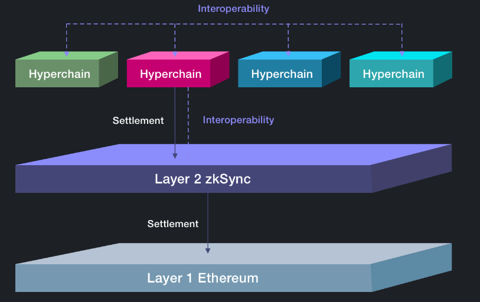
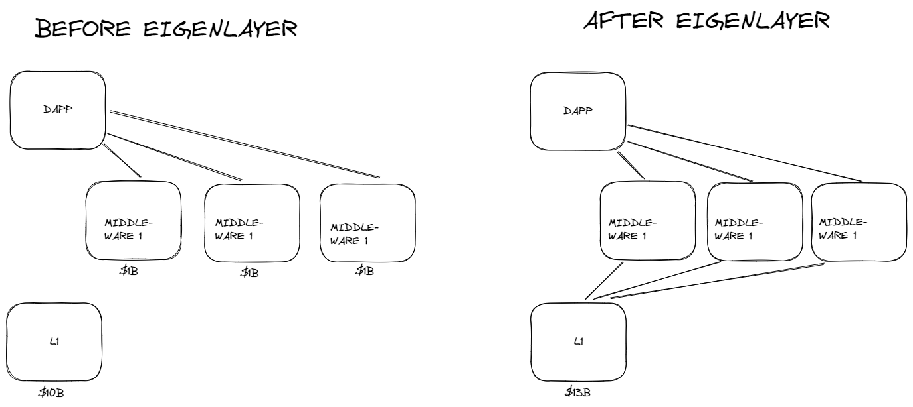
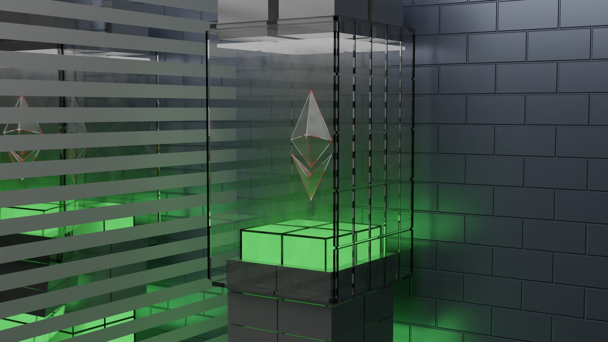
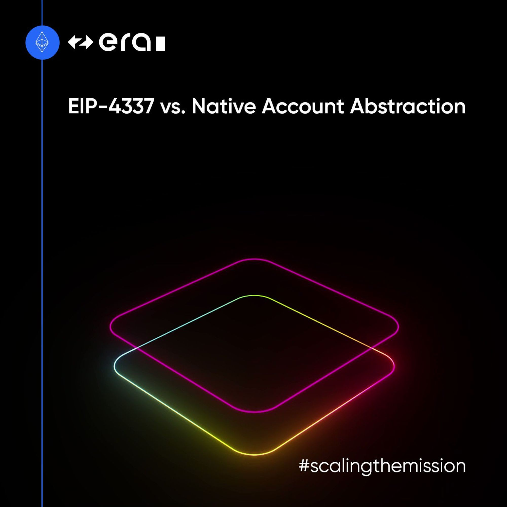
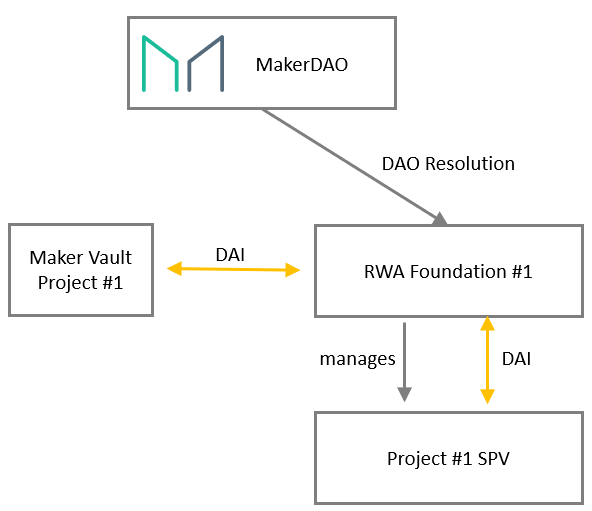

> 茫茫訊息海中，不知道自己要看什麼嗎？
> 未來每週六由走路貓團隊將為您嚴選 10 篇內容，讓您可以快速讀完最近發生的大小事！

# 專案分析

- zkSync 如何透過 Hyperchains 成為擴容的最佳利器？
- Nouns DAO 和治理哲學：美在簡約
- 解讀 Avalanche 最新的 Cortina 升級
- 熊市中獲 5000 萬美元注資，再質押協議 EigenLayer 如何重塑以太坊生態？

# 觀點剖析

- 加密敘事展望：LSD 仍為 S 級敘事，關注 ZK 發展趨勢
- 深入了解區塊鏈應用的可擴展性需求
- DataFi：去中心化數據服務如何改革數據經濟？

# 市場分析
- 對比 EIP-4337 與 zkSync Era 原生帳戶抽象的區别
- DeFi 下一個引擎 — RWA
- zkEVM 方案一覽：簡析 zkSync、StarkNet、Polygon zkEVM 、Scroll

-- 

## zkSsync 如何透過 Hyperchains 成為擴容的最佳利器？

ZK Rollups 和 Optimistic Rollups 除了在驗證機制、安全性及可擴展性的差異之外，ZK Rollups 還有一個最重要的概念就是 **Hyperchains**。

Hyperchains 是類似分形的擴展結構，並且許多不同的 Hyperchains 會**並行**運行，它們的區塊證明最終會被整合進一個最終的區塊內並在 L1 上結算，為了達到互通性及可信任性，Hyperchains 必須由和 zkSync L2 相同的 zkEVM 引擎來驅動。

透過 Hyperchains 的機制，可以在以太坊上達到類似於 Cosmos 的完全互操作性，雖然 zkSync 在當前的開發進程中還是屬於中心化的，不過最後將會走向完全的去中心化，隨著 zkSync 順利推出 Alpha 主網，相信接下來將會接棒 Arbitrum 成為下一個市場矚目的焦點。

- [原文連結](https://twitter.com/ed_Nuward/status/1638296348503031811)

## Nouns DAO 和治理哲學：美在簡約

Nouns 專案結合了 NFT 專案和去中心化自治組織（DAO），以 ERC-721 標準生成由預定義特徵（如沙發和鯊魚頭）組成的藝術品。每天都會有一個 Noun 拍賣，社區可以參與決定第二天 Noun 的特徵。Nouns DAO 允許持有 Noun 的成員對如何使用資金庫中的資金進行投票，投票權與成員所持有的 NFT 數量成正比。

Nouns DAO 面臨的挑戰之一是保持民主制度的信任。為了應對這一挑戰，Nouns DAO 需要通過構建引人入勝的故事和背景，賦予這些 JPEG 意義和象徵意義，以培養團結感、認同感和民主責任感。

最後，Nouns DAO 應該成為一個鼓舞人心的例子，為許多新 DAO 提供靈感。在這些社群中百花齊放，民主和去中心化將在加密時代茁壯成長。讓我們一起圍繞 JPEG 構建一個充滿意義的世界。

- [原文連結](https://followin.io/zh-Hans/feed/3220153)

## 解讀 Avalanche 最新的 Cortina 升級

Avalanche 從去年 10 月開始的 Banff 升級就為整個 Avalanche 的網路系統添加了許多優化機制，例如可制定的彈性子網路、子網路間的訊息傳遞標準 AWM（Avalanche Warp Messaging）以及今年 2 月引入的可構建高性能虛擬機的框架 HyperSDK。

這次最新的 Cortina 升級將於 3/30 在 Fuji 測試網上線，此次升級的內容包括將 X 鏈原本的 Avalanche 共識遷移到 Snowman++ 的共識機制上運行，讓原本的鏈上排序變成「線性化」，以便能和 AWM 兼容與集成，而且也能讓交易所對 X 鏈有更好的支持。另外也引入了 Batched Delegator Rewards 機制來簡化擁有大量委託人的驗證者的費用分配，以及提高了 C 鏈的 gas limit 來增加每個區塊發出的交易複雜性。

Avalanche 雖然當前與 Layer 2 的熱度及話題性相比下稍嫌不足，不過他們仍依照自己的進度一步步地在技術上持續耕耘，這也是為什麼 Avalanche 能夠受到許多 Web2 企業的青睞，相信 Avalanche 之後也能繼續用技術實力驚豔整個公鏈市場。

- [原文連結](https://twitter.com/blockworksres/status/1639294881104539650)

## 熊市中獲 5000 萬美元注資，再質押協議 EigenLayer 如何重塑以太坊生態？

近日，以太坊再質押協議 EigenLayer 的開發商 EigenLabs 獲得了由 Blockchain Capital 領投的 5000 萬美元融資。EigenLayer 旨在通過**再質押（Restaking）**將加密經濟安全性擴展到在以太坊網路上構建的應用程序，被譽為 2023 年以太坊生態系統中最新穎的創新之一。

EigenLayer 的優勢在於為 Oracles 和 Bridges 提供服務，例如同一網路上的數據可用性。該專案已經為以太坊推出了一個名為 EigenDA 的數據可用性層，將允許高達每秒 15 MB 的處理能力，並預期未來處理效率將達到 1GB/s。

EigenLayer 的再質押機制通過顯著**增加惡意攻擊的成本來增強安全性**，提高了以太坊上的互操作性、效率和治理的有效性。多位專家和投資者對 EigenLayer 給予了高度評價，認為其可能是以太坊真正的 Game Changer。

- [原文連結](https://www.bitpush.news/articles/3886564)

## 加密敘事展望：LSD 仍為 S 級敘事，關注 ZK 發展趨勢

本文討論了多個加密領域的趨勢和一些值得關注的專案。以下條列：

1. LSD 風潮：這個趨勢預計將貫穿以太坊後續發展。值得關注的專案包括 $YFI、$PENDLE 和 $AURA。其中，$AURA 是最看好的專案。
2. 儲存：以 $FIL、$AR 和 $BNB 為代表的風潮在加密領域興起，儘管它們的價值在一定程度上受到了炒作的影響。
3. Zk ：以 $MINA、$DUSK、$MUTE 等專案為代表的 Zk 受到了市場對於 zk-rollup 發幣預期和 Polygon ZkEVM 推出而獲得關注。
4. A 級專案：$ATOM、$SNX、$STG 等 A 級專案在短期內值得關注。
5. OKX 品牌建設：$OKB、$OKT 和 $CHE 是值得關注的專案。
6. $OP：雖然 $OP 在過去一年受到了Arbitrum 的壓制，但它在今年可能會有不錯的表現。
7. AI 風：加密 AI 領域主要看熱點事件和敘事的推動。值得關注的專案有 $AGIX 和$FET。
8. 遊戲：以 $PRIME、$ILV 和 $GHST 為代表的遊戲類專案在加密市場受到關注。

- [原文連結](https://www.panewslab.com/zh_hk/sqarticledetails/s3afn8nb.html)

## 深入了解區塊鏈應用的可擴展性需求

本文主要針對當前區塊鏈應用的實際擴展需求和潛在的市場適配性提出相關看法，與過去相比，大多數的區塊鏈產品及應用對於其在市場應用場景適用性上已經有一定的掌握，因此如何在已知的方向上進行產品的擴展是作者想探討的部分。

文中列舉了 4 個主要類型的應用：金錢、DeFi、身份生態系統和 DAOs，並提供每個類型可能所需的擴展方案，除了上述的 4 個類型，還有另一類就是混合型的，也就是包含局部共識及全局共識，大多數的 Web3 應用只需要局部共識以及少部分的全局共識便可滿足市場需求。

最後作者認為擴展的重點應該放在產品、用戶體驗以及引導用戶入門的要素上，並且採取更多以應用為中心的方式可以更好的擴展產品的應用。目前的區塊鏈應用已經發展得越來蓬勃，要如何真正吸引及提升用戶黏著度考驗著產品開發者對產品核心的深入思考。

- [原文連結](https://polynya.mirror.xyz/vqdR7FHEzc-lfsWjA88s1uqYqLSgQoWvWm-KN39Zb2M) 

## DataFi：去中心化數據服務如何改革數據經濟？

在現在這個人人都是數據生產者的時代，如何有效將這些數據統合、交換並產生更大的經濟效益是當前市場的難點之一，許多企業把持著使用者的數據，但這些數據彼此隔離並且不互通，形成數據孤島的現象，而其中也因為牽扯到使用者隱私的因素存在，因此這些數據的價值並不能發揮最大的效益。

不過若將這些數據透過去中心化的方式來保障數據的隱私及安全性的話，將能夠讓企業的數據透過交換及統合的方式創造出新的收益方式，作者介紹了三種可以建構數據經濟生態的數據協議，Streamr 可以讓用戶交換及代幣化他們的實時數據流，Ocean Protocol 允許數據提供者以安全的方式代幣化他們的數據訪問權限，並提供 CtD 的技術解決方案來讓數據提供者在隱私保護下共享數據，最後一個 Chainlink 則是透過將外部數據引入 DeFi 領域中來提供鏈上應用的數據源服務。

未來，數據將不再是單獨被企業握在手裡的「鈔票」，透過更多的數據協議及服務，將能讓這些「鈔票」流通起來，創造出更大的數據經濟價值。

- [原文連結](https://www.techflowpost.com/article/2333)

## 對比 EIP-4337 與 zkSync Era 原生帳户抽象的區别

當前的終端用戶主要是透過外部帳戶（EOA）來和以太坊交互，但這樣的方式會有一些限制，例如必須搭配簽名者才能進行鏈上操作、無法更改已被硬編碼的驗證邏輯，以及沒有任何方法來恢復失去的帳戶，而帳戶抽象概念可以在開發上具備靈活性的操作邏輯，讓用戶的使用體驗提升。

當前主要的帳戶抽象技術 EIP-4337 為了避免形成硬分叉，在其技術上有一些妥協，而 zksync 透過在協議級別集成來改進這些部分，例如將原本必須分離的外部帳戶和合約帳戶的 tx flow、內存池、驗證者角色變成單一的模式，以及 Paymasters 可以被 EOA 來使用等。藉由這些優化，zksync 除了在擴展性上的提升外，也能為帳戶抽象的未來帶來進一步的發展及應用。

- [原文連結](https://twitter.com/zksync/status/1641047524810330114)

## DeFi 的下一個引擎 —— RWA

RWA（真實世界資產）指現金、金屬、房地產等傳統資產。通過代幣化 RWA，DeFi 的市場規模有望大幅提升。如何將 RWA 帶入 DeFi？

通常用智能合約創建代表 RWA 的 Token，並提供鏈下保證。RWA 在 DeFi 中的應用包括穩定幣、合成資產和借貸協議。

RWA Tokenization 有助於擴大 DeFi 市場規模，也有助於傳統金融機構探索新業務模式。

然而，由於信任問題和中心化主體的影響，RWA 可能無法與 Crypto Native Asset 達到同等級別。

RWA 在 STO 等被監管認可的資產代幣化方案方面的發展路徑值得關注。

- [原文連結](https://news.marsbit.co/20230329124221349098.html)

## zkEVM 方案一覽：簡析 zkSync、StarkNet、Polygon zkEVM 、Scroll

zk-rollup 是一種擴展區塊鏈網路相當有前途的解決方案，但數個協議目前沒有對其定義和技術達成共識。然而，它們在實現過程中出現了一些共同趨勢：

1. 採用混合方法處理數據可用性，提供鏈上數據儲存的 rollup 版本和鏈下數據儲存的 validium 版本。
2. 大多避免使用純開源代碼，直至實際運行。
3. 面臨來自 optimistic rollups 的競爭，例如 Arbitrum 和 Optimism。
4. 致力於逐步去中心化以解決集權問題，可能需要引入原生代幣作為經濟激勵。
5. 過去一年，zkEVM 取得了驚人的成果，促使行業關注 zk 技術的各個方面發展，包括開發新的 zk 技術以提高證明生成速度。

**儘管還有挑戰需要解決，但 zkEVM 設計的進展令人矚目，2023 年可能成為這項技術的決定性一年。**

- [原文連結](https://www.techflowpost.com/article/2346)

# 結尾

感謝您閱讀本篇文章，希望本文的內容能夠對您有所啟發和幫助。

如果您對區塊鏈出圈科普知識感興趣，請搜索 🔍 WalkinCat 走路貓，了解更多相關資訊。如果您想繼續關注我們的最新文章，歡迎訂閱我們的電子報，或透過以下連結找到我們。我們期待您的想法和反饋，謝謝您的支持！

- [訂閱走路貓](https://portaly.cc/walkincat)