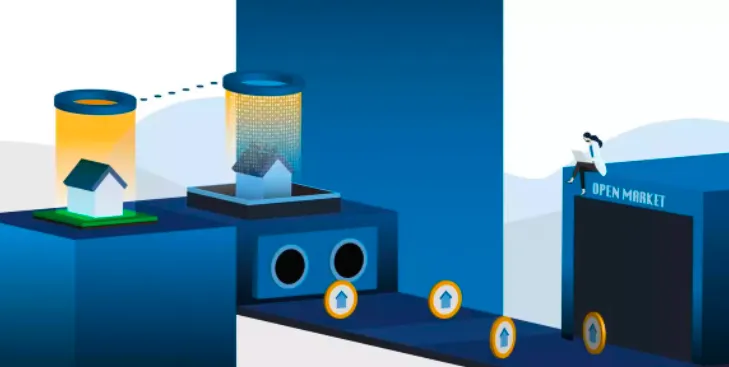

# 專案分析

- 一覽 ZetaChain 在跨鏈領域上的創新與獨特
- 由以太坊區塊空間支持的超額抵押稳定幣 DINERO：有哪些特色及價值？

# 觀點剖析

- 從社群本質探究 Web3 社群產品的現狀和未來
- Flatcoins 能否成為下一個最熱門的 DeFi 故事？
- 交易平台激勵模式思考，流動性和交易行為哪個更值得激勵?

# 市場分析

- ABCDE：重新思考 Appchain、ZK 和 GameFi 賽道
- a16z：2023 年的加密貨幣狀況報告
- 探索不同 RWA 專案的特點和潛力
- 2023Q1 加密投融資報告：市場概況、熱門趨勢與投資機構表現

# 熱門事件
- 上海升級如何推動以太坊前進

-- 
## 一覽 ZetaChain 在跨鏈領域上的創新與獨特

ZetaChain 是可連接智能合約區塊鏈與非智能合約區塊鏈的全鏈智能合約區塊鏈，允許用戶在不同的區塊鏈之間轉移資產且不須透過中間人來執行。目前市場上 TVL 高的跨鏈橋協議大部分都是採用鎖定 / 銷毀再鑄造的方式來達到資產跨鏈的目的，不過這些方式都有其限制，像是需使用包裝資產作為原生資產替代品，或是沒辦法支持非智能合約平台，以及連接網路內不可用的資產，而在驗證機制方面也會有中心化或是部署成本較高的問題。 ZetaChain 為了解決這些限制，開發出相關的工具如：Omnichain 智能合約、帳戶及消息傳遞，並且藉由其網路內的分布式驗證節點來實現跨鏈通訊，同時由驗證節點擔任中繼器與預言機來驗證交易訊息及餵價。其 Omnichain 帳戶可用來管理及驗證外部區塊鏈相關的交易，開發者也可以藉由 Omnichain 的智能合約來建構 Omnichain DApps，ZetaChain 雖然目前聲量與同樣為全鏈互操作協議的 Layerzero 相比之下較弱，不過 Layerzero 在中繼器及預言機的消息傳遞機制設定上仍有其缺點，因此這兩個跨鏈專案最終誰能獲得市場青睞還有待觀察。

- [原文連結](https://twitter.com/tokeninsightcn/status/1640979030844526592)
  

## 由以太坊區塊空間支持的超額抵押穩定幣 DINERO 有哪些特色？

Dinero Protocol推出了一種 ETH 超額抵押型的去中心化穩定幣 DINERO，用戶除了透過在 Dinero Protocol 中抵押他們的 ETH 生成 LSD 代幣 pxETH 賺取質押收益，並且可藉由抵押 ETH 借貸出的 DINERO 穩定幣作為交換媒介，允許用戶擁有他們的區塊空間以及訪問高級的去中心化 RPC 來保護用戶的交易隱私，並且避免受到 MEV 的攻擊，這樣的方式也讓以太坊的區塊空間市場變得更加民主化，有助於實現更公平的 DeFi 生態系統。

- [https://twitter.com/redactedcartel/status/1643994653325156353](https://twitter.com/redactedcartel/status/1643994653325156353)

## 從社群本質探究 Web3 社群產品的現狀和未來

傳統的中心化社群平台雖然有巨大的用戶基數，但是在數據隱私及內容審查上面仍被許多人詬病，尤其用戶的數據擁有權並不屬於用戶個人所有，因此用戶也開始轉向去中心化社群平台，希望能藉由這些平台或工具來確保他們的隱私及自主權。

目前市場上 Web3 的社群產品包括 DID、社交圖譜（Social Graph）、社群媒體等相關基礎設施以及應用，這些 SocialFi 的產品透過發行代幣來更好的創造整個社群生態系的經濟，這些代幣共分成三類，代表狀態或連結參與度象徵的個人代幣、由去中心化自治組織治理並激勵社群成員做出貢獻的社群代幣，以及便於創作者發行並管理 Token 化社群的鑄造分發平台幣。

不過 Web3 社群平台目前仍面臨一些問題，像是數據存儲成本高、跨平台互動困難、可持續性的經濟模式及商務拓展白熱化，後續作者也提到優化這些產品的切入點可以透過借力 NFT 來建構社交圖譜或是採用 zk 隱私技術來增進產品優勢。雖然目前的 Web3 社群產品還有許多問題尚待解決，不過隨著技術進步，未來他們終究會變得更加成熟並走入更多人的視野。

- [https://www.panewslab.com/zh/articledetails/l87j29be.html](https://www.panewslab.com/zh/articledetails/l87j29be.html)

## Flatcoins 能否成為下一個最熱門的 DeFi 故事？

本文介紹了 Flatcoins 的背景以及其機制，Base 前陣子在官方部落格中提到他們很樂意看到開發者持續探索 Flatcoins 這個領域，Flatcoins 是一種跟蹤通貨膨脹率的去中心化穩定幣，鑑於近期全球的金融體系以及金融環境所面臨的挑戰，能讓使用者的貨幣擁有穩定的購買力和抵禦經濟不確定性的能力顯得更為重要。Flatcoins 背後主要是與一籃子的資產或指數掛鉤，並不與任何法定貨幣掛鉤，透過這樣的方式可以讓貨幣的價值不會因通貨膨脹的關係而被侵蝕，進而保持其購買力。

過去在 DeFi 領域 $RAI 是與非法定貨幣掛鉤的典型例子， $RAI 主要透過贖回價格的機制來實現其穩定性，不過這樣的方式也有其缺點，例如價格的不可預測性和唯一的 ETH 抵押品會限制代幣的使用擴展，或是市場價格劇烈變化導致清算風險增加。目前市場出現新的去中心化 flatcoins－Nuon，主要透過通貨膨脹指數預言機 Truflation 來計算 Nuon 的掛鉤，並且借款人只需保持所需的抵押率就能享有 Nuon 的零利率貸款，不過 Nuon 雖然在對抗通貨膨脹有其當前的趨勢優點，但是依市場數據來看其採用率並不高，或許當前這樣的穩定幣形式仍是理想面多於現實面。

[https://twitter.com/0xShinChannn/status/1642173226834083841](https://twitter.com/0xShinChannn/status/1642173226834083841)

## 交易平台激勵模式思考，流動性和交易行為哪個更值得激勵?

本文作者一開始針對交易平台的代幣激勵設計動機進行說明，這些激勵措施主要是希望實現新平台的冷啟動以及做大雙邊（流動性提供者和交易者）市場，透過兩邊的互存互利來達到跨邊網路效應，形成平台的護城河。

過往中心化交易所就已開始採用交易挖礦的激勵方式來吸引用戶，最有名的莫過於 FCOIN，不過這樣的方式雖然短期帶來交易熱度和大量用戶，不過最後隨著早期用戶套利砸盤造成死亡螺旋以及內部財務問題走向滅亡。後續 DeFi 專案上因 Uniswap 的 AMM 機制讓流動性挖礦的激勵模式漸漸在 Dexs 以及 NFT 交易平台被大量實踐，而採用交易挖礦的相比之下仍是少數。

代幣激勵要以哪些行為對象在激勵衰減後仍會留存作為主要的激勵目標，作者目前認為流動性提供者會是較好的激勵對象，原因包括 LP 用戶更容易被平台綁定、對其他新產品的遷移意願較低、最小化交易耗損等。平台若欲採用交易激勵方式可藉由激勵交易量更大的流動性池，或是控制激勵價值以及把交易補貼變成是短暫的運營活動來做設計。

在 Web3 的世界因為帳戶體系和自由度的關係，要提升用戶留存率十分困難，因此專案想要持續發展必定要有長期作戰的決心及能力，才能在這片紅海中生存下來。

[https://research.mintventures.fund/2023/04/10/zh-liquidity-vs-trading-behavior-an-in-depth-analysis-of-incentive-models-on-trading-platfoms/](https://research.mintventures.fund/2023/04/10/zh-liquidity-vs-trading-behavior-an-in-depth-analysis-of-incentive-models-on-trading-platfoms/)

## ABCDE：重新思考 Appchain、ZK 和 GameFi 賽道

ABCDE 透過在 Q1 所經歷的許多專案來分析及思考應用鏈、ZK 系列跟 Gamefi 這三個賽道的狀況。應用鏈中的 RAAS（Rollup as a Service）近期因 OP Stack 的發布越來越多人關注，不過不管是要開發 EVM 或是非 EVM 的應用鏈，目前市場上都有許多選項可以讓開發者做選擇，作者認為短期來看這麽多能發鏈的基礎設施包含 RAAS 是否有其必要性，又或只是被過度炒作了。

在 ZK 這個領域來看，雖然 ZK-Rollup 的幾個專案主網都在今年上線，不過其在完成度、性能、費用及現階段的安全性上仍有許多問題尚待解決，不過 ZK 在中間件的發展相對於擴容方面則有更好的發揮，例如可以透過 ZK 證明來免除第三方見證人的要求，進而提升橋的安全性，甚至將原本分裂的生態互相連結起來。

而在 Game 領域算是當前最火熱的賽道，雖然 Axie 和 StepN 的 X2Earn 模式最後還是失敗，不過他們的破圈程度也讓很多人認為遊戲仍是一個很好的切入點。目前 Gamefi 領域主要朝幾個方向在摸索，包含 3A、休閒社交類、新 X2Earn 、NFT 的 Free to Own、作為 Web 3 的遊戲任天堂、DeFi 概念遊戲化以及開發全鏈遊戲，不過因爲 Gamefi 和遊戲本質有著截然不同的方向，因此這兩著者能不能夠達成新的平衡還有待觀察。

這些都是 ABCDE 看好的賽道，或許短期內無法得到太多的成效，但長期來看或許更能夠帶來驚人的價值增長。

[https://medium.com/@ABCDE.com/cn-abcde-香港大会-重新思考3个热门赛道-14a3f996f10f](https://medium.com/@ABCDE.com/cn-abcde-%E9%A6%99%E6%B8%AF%E5%A4%A7%E4%BC%9A-%E9%87%8D%E6%96%B0%E6%80%9D%E8%80%833%E4%B8%AA%E7%83%AD%E9%97%A8%E8%B5%9B%E9%81%93-14a3f996f10f)

## a16z：2023 年的加密貨幣狀況報告

加密創投 a16z crypto 在其最新發布的加密貨幣狀況報告中提到當前的整個加密產業表現出比市場價格更健康且產品的推出及創新也處於穩定的發展趨勢。

而 a16z crypto 還推出了一個新的加密貨幣指數的互動工具，主要是從技術而非金融的角度來追蹤加密貨幣產業的健康狀況，這個指數代表 14 個產業指標的加權平均月增長率，也反映了推動加密貨幣市場週期的創新和採用率。

這個圖表中也得出了目前加密貨幣現況的七個要點：

1. 區塊鏈擁有更多的活躍參與者以及參與方式。
2. DeFi 和 NFT 因許多新的應用和功能出現而熱度再度上升。
3. 加密產業的活躍開發者數量穩定上升。
4. 區塊鏈正透過有前景的新路徑（Layer 2）持續擴展中。
5. 新技術（零知識證明）一旦被完全實踐將會讓區塊鏈變得更加落地。
6. 美國正失去在 Web3 的領導地位。
7. 可以看到許多關鍵指標（市值、開發者活動、資金活動）長期是處於穩定的發展狀態。

[https://a16zcrypto.com/content/article/state-of-crypto-report-2023/?s=35](https://a16zcrypto.com/content/article/state-of-crypto-report-2023/?s=35)

## 探索不同 RWA 專案的特點和潛力

本文關注現實世界資產（RWA）專案，這類專案可以將現實世界的資產代幣化，並引入到去中心化金融（DeFi）生態系統中。文章對五個備受關注的 RWA 專案進行了比較和介紹：$LEOX，$THEO，$LABS，$ELFI 和 $FACTR。

在評估這些專案時，作者參考了以下幾個方面：
1. 專案提供的服務：了解這些專案具體提供什麼樣的服務以及它們在市場上的定位。
2. 獨特特點：關注專案的獨特性和創新，這有助於了解其在競爭中的優勢。
3. 專案的潛力：評估專案的成功潛力和未來發展前景。
4. 有效的產品：擁有有效產品的專案更有可能獲得成功，因此在選擇投資專案時要重點關注此類專案。

總的來說，在投資 RWA 專案時，應避免盲目跟風，具有獨特技術和創意的專案值得關注，而對於那些將現實世界與 DeFi 結合的說法過於膚淺和無意義的專案，要保持謹慎。

[https://www.techflowpost.com/article/detail_11703.html](https://www.techflowpost.com/article/detail_11703.html)

## 2023Q1 加密投融資報告：市場概況、熱門趨勢與投資機構表現

文章概述了2023年第一季度加密投融資市場的情況，主要觀點如下：

1. 第一季度加密行業融資總金額達到 23.17 億美元，同比下降約 81%，環比下降 33%。
2. 投資機構在熊市周期中相對謹慎，一級市場融資節奏出現斷崖式下跌。二級市場相較於一級市場更受投資者青睞，因為許多項目的一二級市場估值出現倒掛。
3. 基礎設施賽道的融資筆數和金額均為九大賽道中最高，平均單筆融資額超過 1000 萬美元，熱門融資項目包括模組化區塊鏈、zk 等。
4. DeFi 賽道的融資筆數位列第二，融資金額排名第四，熱門領域細分為 DEX、衍生品等。
5. 遊戲和社交娛樂賽道分別位列融資筆數的第三和第四位，遊戲平臺、創作者經濟在 2023 第一季度備受資本青睞。

整體而言，市場信心受到了美國銀行擠兌危機和監管機構對中心化交易所的打壓影響，加密資產仍在二級市場表現不俗。加密領域內的多個訊號顯示出強勁的復甦和增長跡象。

[https://www.chaincatcher.com/article/2091100](https://www.chaincatcher.com/article/2091100)

## 上海升級如何推動以太坊前進？

從 2020 年以太坊開放質押合約讓大家可以透過質押 ETH 成為驗證節點賺取獎勵，再到這次的上海升級，中間兩年多的時間質押進去的 ETH 都被鎖在合約中無法提領，也因此帶動了解決流動性問題的 LSD 領域變成加密市場眾所注目的焦點。這次的上海升級順利讓鎖定的 ETH 可被提領，代表著未來在以太坊上質押賺取驗證獎勵的風險大幅下降。

文中提到過往這些 LSD 對於機構投資者在稅收及監管上有其障礙，像 Lido 這類的協議為了鼓勵用戶在其協議上增加流動性而採用的激勵措施反而讓這些 LSD 看起來更像證券，因此這次的升級將讓 SaaS 或是單獨的質押解決方案可以為這些機構提供服務，並同時保留質押流動性以及免去在稅收和監管上的問題。

這次的升級除了解決了 LSD 之外的抵押品流動性問題外，還能讓市場重新分配 ETH 的抵押份額，減少 LSD 服務提供商在驗證節點的控制權，進一步讓整個網路走向更去中心化的方向。

過往在 ETH 的質押收益比其他標的更吸引人時市場通常能做出相對應的回應；不過在相反情況下，過去驗證者對於在有其他收益率替代品出現的情況下並不能隨意退出，然而在上海升級後這樣的情形將會徹底改變。總體來看，這次的升級都將會是歷史上最重要的時刻，也會是以太坊發展進程中的一大步。

[https://www.bankless.com/how-shapella-pushes-ethereum-forward](https://www.bankless.com/how-shapella-pushes-ethereum-forward)

# 結尾

感謝您閱讀本篇文章，希望本文的內容能夠對您有所啟發和幫助。

如果您對區塊鏈出圈科普知識感興趣，請搜索 🔍 WalkinCat 走路貓，了解更多相關資訊。如果您想繼續關注我們的最新文章，歡迎訂閱我們的電子報，或透過以下連結找到我們。我們期待您的想法和反饋，謝謝您的支持！

- [訂閱走路貓](https://portaly.cc/walkincat)