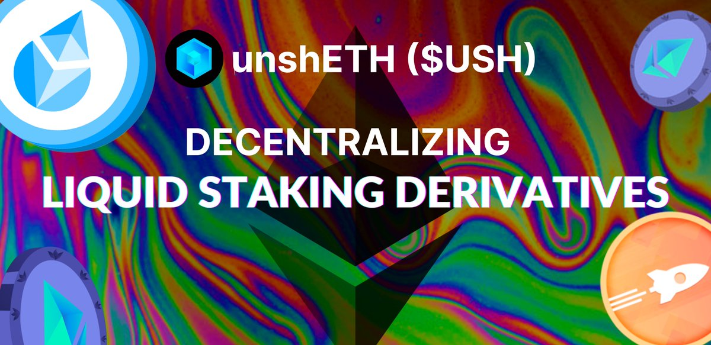
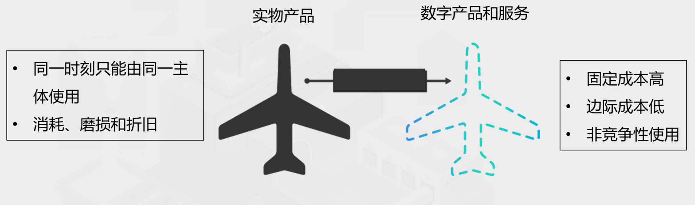
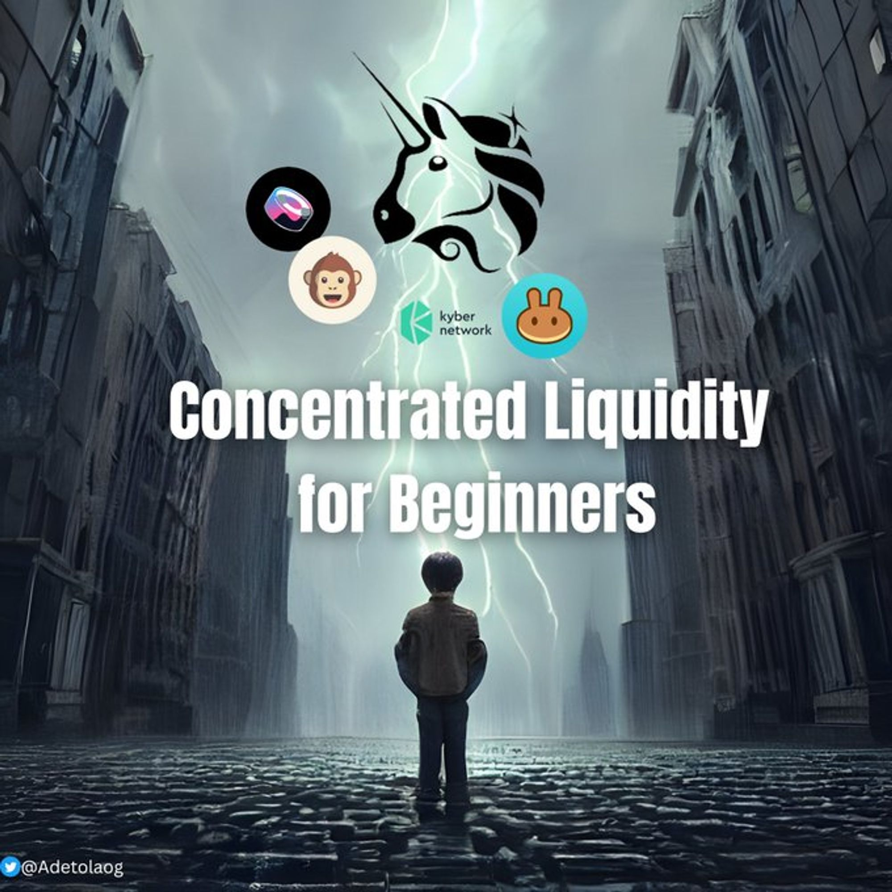
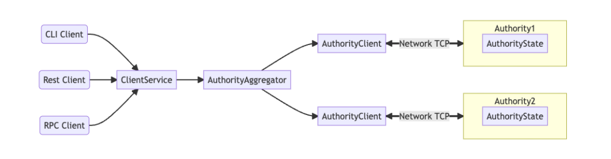
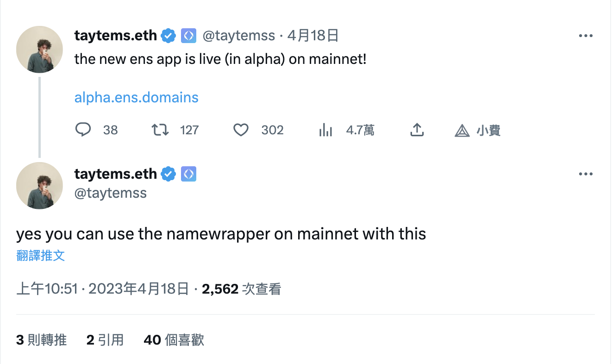
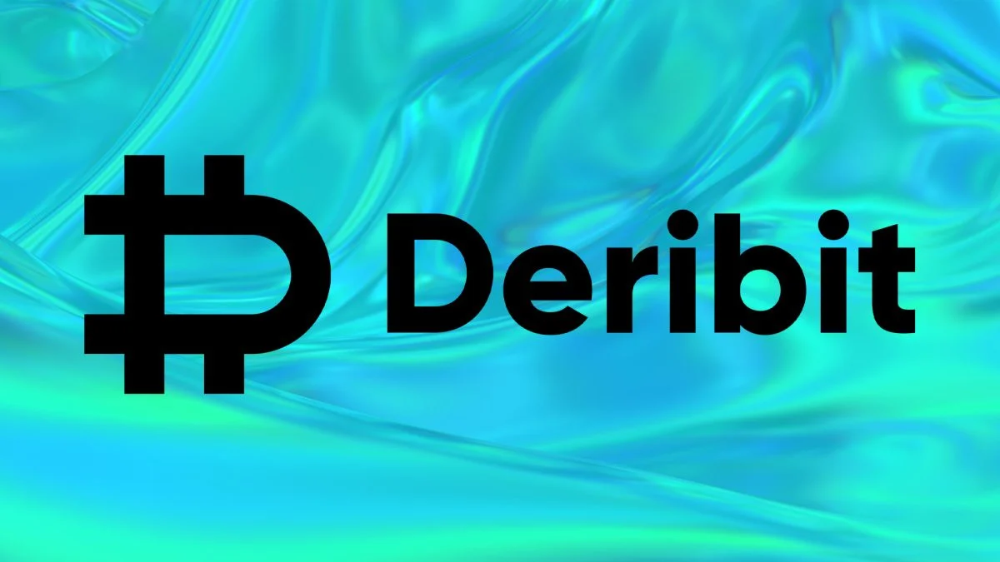

## 專案分析

- 一覽由激勵機制優化驗證者去中心化的 LSD 協議－unshETH

## 觀點剖析

- HashKey：Web3 新經濟和代幣化
- 重新審視跨鏈橋，模塊化區塊鏈世界的跨鏈橋是什麼樣子
- 探討建立 DeFi 信用借貸的可行性方案 —— 威懾紀元 RWC 模型

## 市場分析

- 集中流動性的探索指南
- 共享排序器如何帶來網路效應？
- Web3 協議的取捨：選擇價值捕獲還是可防禦性？
- 復盤 PEPE 和 AIDOGE 暴漲背後，我們如何與迷因幣共舞

## 熱門事件

- 主網上線在即，如何向你的朋友介紹 Sui Network？
- ENS 在主網上線新 App（Alpha版），支援子域名封裝器
- 最大的比特幣期權交易所 Deribit 推出零費用現貨交易

--

## 一覽由激勵機制優化驗證者去中心化的 LSD 協議－unshETH

UnshETH是一個新的 LSDfi 協議，主要藉由激勵機制來優化 LSD 驗證者的去中心化，透過 vdMining（驗證者去中心化挖礦）和 VDOs（驗證者支配期權）兩個創新性的方式來實現。 vdMining 是一種代幣分發機制，目的是為了獎勵用戶能夠以符合 unshETH 社區設置的最佳去中心化比例方式來質押其 LSD，而 VDOs 則是允許占主導地位的 LSD 持有者在自己的驗證器上編寫期權來賺取額外收入，非主導地位的 LSD 也能夠獲取收益。目前 unshETH 已在以太和幣安鏈上運行，並使用 LayerZero 作為底層的跨鏈橋。作者認為目前代幣價格處於被低估的狀態，或許 unshETH 的創新激勵機制能夠解決當前以太坊社區在提升驗證者去中心化程度及安全性上所面對的難題。

[https://www.panewslab.com/zh/articledetails/kczx185a.html](https://www.panewslab.com/zh/articledetails/kczx185a.html)

## HashKey：Web3 新經濟和代幣化

本文介紹了 Web3 新經濟和代幣化的概念，以及如何在其中高效地組合、轉化、流通和分配各種價值。Web3 新經濟以區塊鏈為代表，強調數據可信、數據主權和價值互聯。代幣化是將各種價值轉換為數字資產（Token），並用於交換和交易。代幣經濟學是實現 Web3 新經濟健康發展的關鍵，包括貨幣政策、機制設計和金融工程。

在 Web3 新經濟中，使用權比所有權更重要，因為使用權具有共用性，可以多次授予並相互增益。代幣不僅代表使用權，還可以用於身份證明、能力證明、行為證明、工作量證明、貢獻度證明、活躍度證明以及產品和服務證明等。通過激勵機制，利益相關者可以充分發揮其作用，實現 Web3 新經濟的健康發展。

[https://news.marsbit.co/20230416160733178881.html](https://news.marsbit.co/20230416160733178881.html)

## 重新審視跨鏈橋，模塊化區塊鏈世界的跨鏈橋是什麼樣子

本文探討了加密貨幣世界中跨鏈問題的挑戰和解決方案，隨著加密貨幣生態系統的模塊化和交叉鏈的使用增加，跨鏈交易將會變得更加複雜。作者提到，要實現跨鏈交易，需要解決的問題包括：如何從一個區塊鏈安全地傳輸訊息到另一個區塊鏈、如何驗證正確的訊息以及在實踐中的狀況下如何進行操作等問題。要解決這些問題需要優先考慮橋的安全性和可擴展性，因為橋涉及到加密貨幣世界的所有層面。

作者也討論如何透過模塊化來解決互操作性的三難問題，以及如何實現軟隔離的終局。實現跨鏈交易涉及到驗證共識、欺詐和有效性證明，不同的驗證方法會讓驗證跨鏈交易變得更為複雜，因此需要仔細考慮每種驗證方法的優缺點並採取適當的措施，才能讓跨鏈交易變的更加安全。

[https://0xjim.medium.com/revisiting-bridges-d6c09dfbb0cb](https://0xjim.medium.com/revisiting-bridges-d6c09dfbb0cb)

## 探討建立 DeFi 信用借貸的可行性方案－威懾紀元 RWC 模型

DeFi 中缺乏信用借貸一直是其無法達到傳統金融借貸量體的主要問題，為了進一步發展 DeFi 領域，需要透過引入穩定幣、現實資產和現實信用來擴展 DeFi 的規模。

本文提出的模型探討了一種建立鏈上信用體系的可能性，稱為「威懾紀元 RWC 模型」。

該模型透過**零知識證明技術**在誠實交易時保護隱私，發生惡意行為時則自動向現實世界司法部門發送個人訊息及作惡證據，實現現實世界的責任追究。

建立鏈上信用體系的難點在於鏈上累積的數據源較少以及錢包的匿名性關係，但是若能透過現實 KYC 的資訊、ZK-DID 和鏈上錢包的映射，或許就可以解決這些問題。

不過這樣的鏈上信用模型還很早期，但它可以為 Web3 領域帶來拋磚引玉的效果，最終將能夠發展成去中心化且專屬於 Web3 世界的鏈上信用評估體系。

[https://twitter.com/BirkSamo/status/1647843159601467398](https://twitter.com/BirkSamo/status/1647843159601467398)

## 集中流動性的探索指南

DeFi 中的集中流動性旨在改善流動性池的資本效率，使 LP 集中資金投放在最熱門的產品上，從而獲得更高的收益率。傳統 DeFi 中的 AMM（如Uniswap V2）將流動性分散到所有價格範圍，從而導致流動性提供者在資金使用上的低效率。透過集中資金將其投放在特定的價格範圍，可以為每筆的投資資金賺取更多的費用。

集中流動性的特點包括可定制價格範圍、提高資本效率、減少無常損失及自定義費用等級，並且可透過限制所選範圍內的價格變動來降低風險。

用戶若希望保持集中流動性投資的最大收益，必須好好關注市場趨勢並選擇最有利可圖的價格範圍，隨著市場變化調整價格範圍來最大化自己的投資報酬，唯有充分做好研究才能夠做出最明智的投資決策。

[https://twitter.com/AdetolaOG/status/1647192048234303488](https://twitter.com/AdetolaOG/status/1647192048234303488)

## 共享排序器如何帶來網路效應？

本文作者認為共享排序器會是當前加密貨幣中真正的商業機會之一，由於共享排序器可以在多個鏈之間進行交易，因此可以實現同步跨鏈原子的可組合性。原子的可組合性能夠實現跨鏈代幣的橋接、跨鏈套利、閃電貸款、在不同鏈上進行支付與交易，以及 NFT 互換等眾多應用。

共享排序器的存在為鏈之間的交互增加更多的靈活性和便利性，但共享排序器需要透過輕客戶端或有效性證明來驗證並確保每個鏈的交易獨立執行。此外，共享排序器因為是鏈與鏈之間的互操作性市場，能夠捕獲跨鏈的 MEV，並且提供用戶更好的服務及獲得跨鏈活動的收入，因此它們將能夠為加密貨幣市場帶來更優質的網路效應，促進更多的新生代加密貨幣的發展。

[https://twitter.com/divine_economy/status/1643995475216039938](https://twitter.com/divine_economy/status/1643995475216039938)

## Web3 協議的取捨：選擇價值捕獲還是可防禦性？

在 Web3 協議中，價值捕獲是指協議及其所採用的代幣經濟機制可以按照所捕獲價值的多少進行排序，而可防禦性則是指協議擁有足夠的安全性和去中心化程度，以保護其核心競爭力不被攻擊。通常在設計協議時需要在價值捕獲（Value Capture）和可防禦性（Defensibility）之間進行權衡，因為這兩者存在互相制約的關係。

傳統領域許多企業會尋求市場壟斷來達到價值捕獲最大化，不過在加密領域要實現壟斷相對較困難，因為很難構建可防禦性。

透過代幣經濟槓桿（捕獲價值/創造價值）可以了解協議的價值捕獲力，越高的代幣經濟槓桿其捕獲價值越高，協議也可透過替代性的價值捕獲方式來增加可防禦性。

因此， 如何在價值捕獲議題上取得平衡是大部分 Web3 協議在代幣經濟機制設計上的難題，唯有找到價值捕獲和可防禦性之間的完美平衡才能真正實現協議的價值。

[https://foresightnews.pro/article/detail/30778](https://foresightnews.pro/article/detail/30778)

## 復盤 PEPE 和 AIDOGE 暴漲背後，我們如何與迷因幣共舞

文章中分析了近期幾個迷因幣的迷因現象特點，AIDOGE 是 Arbitrum 上的專案，它將 95% 的代幣空投給符合領 Arb 代幣的帳戶，並透過越早領取代幣數越多，以及交易燃燒税和幸運空投等機制來炒熱市場氣氛；而 Pepe 則是在沒有預售、零燃料稅、LP 代幣被銷毀以及放棄合約權限的前提下秘密推出。若想搭上迷因的列車，就要注意代幣這三種特徵：是否向廣泛的群體免費公平分發、代幣總量極高且價格零位數多、具創新或易傳播的話題。最後作者提到要判斷下一個專案是否能興起，需要從操盤者的角度去理解以及想像是否具有上述的三種特徵，並且能夠引起市場共鳴。不過這些都必須建立在市場平穩以及風險係數較低的前提下才能成立。

[https://web.panewslab.com/zh/articledetails/c588ljqt.html](https://web.panewslab.com/zh/articledetails/c588ljqt.html)

## 主網上線在即，如何向你的朋友介紹 Sui Network？

本文介紹了Sui Network，是一個 Layer1 區塊鏈，運行在一組獨立的驗證者上，並使用原生 Token —— $Sui 來獎勵驗證者。Sui 的驗證機制基於「Proof-Of-Stake」，確保驗證者可以達成共識並獲得回報。

**Sui 區塊鏈允許構建者使用一種名為 Move 的語言創建各種應用程式。**

Sui 的核心概念包括獨特的對象，包括共享對象和擁有對象，這有助於提高交易效率和降低資源成本。擁有對象的交易不需要達成共識，並且可以實現近乎實時的交易。通過增加驗證節點的處理能力，Sui 可以實現更好的規模化，並保持穩定的 Gas 費用，吸引更多用戶加入生態系統。

Sui Move 是 Sui 的原生程式語言，整合了區塊鏈開發人員所需的功能，以創建高性能、安全和功能豐富的應用程式。

[https://mp.weixin.qq.com/s/8BBhSLhPo2wEZ4Tt63R7Jw](https://mp.weixin.qq.com/s/8BBhSLhPo2wEZ4Tt63R7Jw)

## ENS在主網上線新 App（Alpha版），支援子域名封裝器

4 月 18 日，以太坊域名服務商 ENS 現已在主網上線新 ENS App（Alpha 版），並支援 NameWrapper（子域名封裝器）。 NameWrapper 通過將現有 ENS 功能變數名稱封裝為 ERC-1155 Token 來增強功能，包括更好地控制封裝功能變數名稱的許可權，賦予子功能變數名稱更多的許可權。

[https://www.theblockbeats.info/flash/136105](https://www.theblockbeats.info/flash/136105)

## 最大的比特幣期權交易所 Deribit 推出零費用現貨交易

全球最大的加密貨幣期權交易所 Deribit 即將於 4 月 24 日推出零費用現貨交易所以進入現貨交易市場。

該交易所將初始提供三對現貨交易：BTC/USDC、ETH/USDC 和 ETH/BTC，並在未來可能上架更多代幣。

Deribit 是加密期權市場的領導者，並在比特幣和以太幣期權交易中佔據超過 90% 的市場份額。

為了吸引更多的零售用戶，Deribit 計劃通過推出現貨交易擴大其業務範疇，該公司還計劃在杜拜獲得加密許可證，並將總部遷至該市。

[https://www.theblock.co/post/227224/deribit-spot-trading-exchange](https://www.theblock.co/post/227224/deribit-spot-trading-exchange)

# 結尾

感謝您閱讀本篇文章，希望本文的內容能夠對您有所啟發和幫助。

如果您對區塊鏈出圈科普知識感興趣，請搜索 🔍 WalkinCat 走路貓，了解更多相關資訊。如果您想繼續關注我們的最新文章，歡迎訂閱我們的電子報，或透過以下連結找到我們。我們期待您的想法和反饋，謝謝您的支持！

- [訂閱走路貓](https://portaly.cc/walkincat)