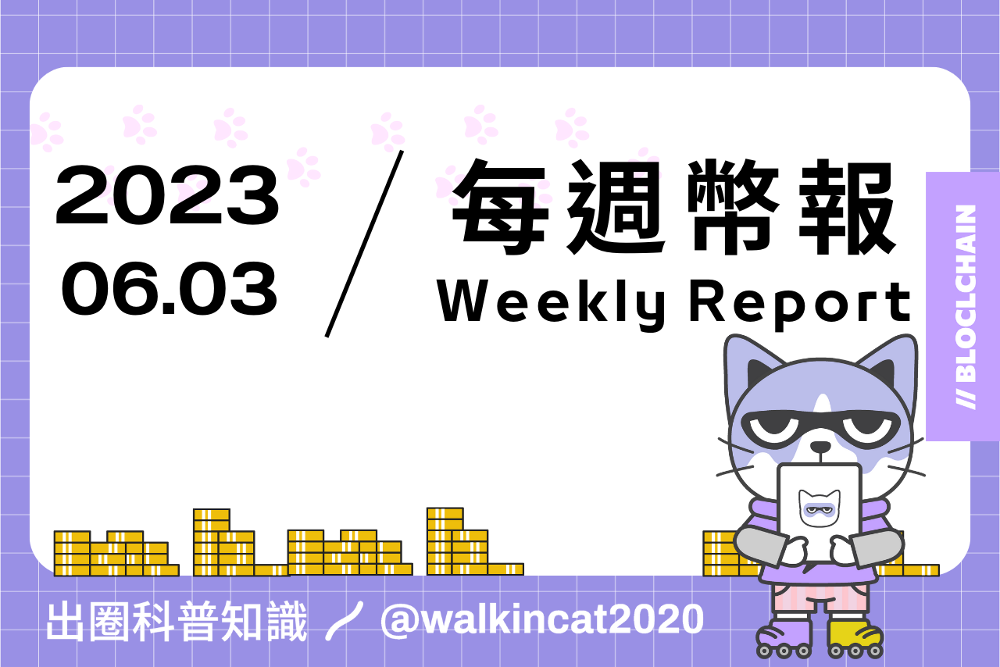

## 專案分析

- 淺析比特幣新協議：BRC-721E
- Prisma Finance ： 釋放流動性質押代币的巨大潛力
- 關於 Optimism Bedrock 升级你需要知道的一切
- 讀懂 Suave：讓 MEV 變成以太坊的一層

## 觀點剖析

- 鏈上數據洞察：哪些協議增長最快？趨勢和敘事在哪？
- BTC 當前充滿糾結與爭論的技術棧和趨勢
- 如何在流動性投資中建立投資信心和規模

## 市場分析

- 代幣分析框架：識别低市值代幣的潛力與回報
- Avalanche DeFi 負責人：在 L2 時代，L1 的角色是什麼？

## 熱門事件

- 香港虛擬資產新規落地，Web3 黃金時代開啟

---
    
## 淺析比特幣新協議：BRC-721E
    
推文中介紹了 BRC-721E 的協議內容，BRC-721E 是可以讓 ERC-721 NFT 遷移到比特幣上的協議，並且不需要提前在 Ordinal 上建立收藏品的集合。與 teleburn 的方法相比，BRC-721E 允許在進行銘刻前就先燒毀，它將數據編碼在燒毀交易中，該交易會指定一個比特幣地址來接收銘文。

BRC-721 的銘文大約有 100 個字節，不僅比圖像便宜得多，質感也大大的提升。有關 BRC 的應用及技術越來越多，不過這樣的熱度是否會繼續持續下去，或是能為比特幣生態帶來什麼影響，有待後續的觀察。
    
👉 https://twitter.com/kiwi_dream/status/1663266009841811457
    

    
## Prisma Finance ： 釋放流動性質押代币的巨大潛力
    
Prisma Finance 是一種可以釋放以太坊流動性質押代幣（LST）潛力的 DeFi 協議。用戶在 Prisma 中可以抵押其流動性質押代幣，並鑄造出全抵押穩定幣（acUSD）。用戶可以把這個穩定在 Curve 和 Convex Finance上質押來獲得額外的獎勵收益，如交易費、CRV、CVX 和 PRISMA。 Prisma 的代碼是基於 Liquity，擁有其不便性，並且在治理層面上也新增加了抵押品、參數等方面的靈活性。
    
此協議與 Lybra finance 同為 LSDfi 穩定幣賽道的競爭者，不過 Prisma 除了已得到了許多頂尖創始人和機構的支持，其可用來抵押的 LST 種類與穩定幣的應用場景目前都比 Lybra 來的多，而 Lybra 也即將推出 V2 來改善以上的問題，究竟這兩者誰能站穩 LSDfi 穩定幣賽道的地位，我們可以拭目以待。
    
👉 https://www.techflowpost.com/article/detail_12053.html
    

    
## 關於 Optimism Bedrock 升級你需要知道的一切
    
Optimism 主網將於 6 月 6 日進行 Bedrock 升級，此次升級的主要目標是縮小和 Layer1 的差距、減少交易成本並提高交易速度。目前 OP 主網雖然與以太坊的 EVM 兼容但非等價，升級後 Optimism 主網與以太坊代碼的差異將從 3000 行縮小至 500 行以內，進而彌平兩者間的差距。此外，Bedrock 升級除了會支持 EIP1559 協議，還優化了數據的壓縮策略以降低原先Layer1 的安全費，原本用來在 Layer1 上存儲 Layer 2 交易的 CTC 合約也會被移除，從而降低 gas 費，存款速度也會提升。最後在安全方面，升級後除了會更接近原先規劃的理想欺詐證明系統，也額外引入了提款步驟相關的安全機制。
    
雖然 Optimism 在 5月底解鎖了大量代幣，影響幣價表現，不過也因為隨後伴隨著 Bedrock 升級的消息，代幣表現也開始慢慢反轉，後續 Optimism 能不能憑藉著升級追上 Arbitrum 的腳步，還得看市場願不願意將目光重新投注在它身上。
    
👉 https://twitter.com/jason_chen998/status/1663587795385061376
    

    
## 讀懂 Suave：讓 MEV 變成以太坊的一層
    
本文說明了 Suave 的原理以及其工作流程，Suave（the Single Unifying Auction for Value Expression, 單一統一價值表達）是由 Flashbot 團隊於近期推出的創新功能，旨在解決以太坊面臨的惡意 MEV 問題。Suave 是一種結構化交易的框架，藉由交易池來管理待處理的交易，並且使用預處理方式來分析交易，進而優化交易執行的順序以及提高交易效率和可預測性。Sauve 提供統一的拍賣平台，讓不同的價值表達可以在同一平台上競拍，促進不同類型價值表達的交換和流動，公開透明的競價過程也減少了 MEV 中的不公平行為和操縱機會。此外，Suave 的可組合性也能擴展並支持不同的鏈，從而實現跨鏈的 MEV，相信這個創新的功能將能為以太坊生態系統帶來了更高效和公正的交易環境。
    
https://panewslab.com/zh/articledetails/yc5jgjns0702.html
    

    
## 鏈上數據洞察：哪些協議增長最快？趨勢和敘事在哪？
    
加密分析師 The DeFi Investor 透過鏈上數據觀察到一些引人注目的趨勢和資金動向。在快速增長的協議方面有三個協議，第一個是 Lybra Finance，由 LSDs（stETH）支持的利息穩定幣專案，其總鎖倉價值在短短 3 週內增加了 10倍；第二個是 GND Protocol，它是 Arbitrum 上 gmUSD 收益穩定幣的母協議，它已經成爲 Arbitrum 上排名第四的真實收益項目；最後一個則是 Asymetrix，主要透過質押進行非對稱收益分配的協議，也在一個月內 TVL 達到 1300 萬美元。
    
作者也發現 LSDfi 和全鏈敘事仍是主要的熱門趨勢，在聰明資金動向方面，Render Token（$RDNR）是被許多聰明錢包廣泛持有的代幣，另外也可看到這些聰明錢包至少都持有一種 LSD 的代幣，代表大部分加密貨幣 VC 對 LSD 敘事仍持續看好。藉由觀察這些透明公開的鏈上數據，我們也能夠一窺大戶玩家的投資方向，進而根據這些數據做出更有效的市場判斷及投資決策。
    
https://www.techflowpost.com/article/detail_12041.html
    

    
## BTC 當前充滿糾結與爭論的技術棧和趨勢
    
    本文詳細說明了 BTC 所遇到的爭議，並詳述其當前的技術棧和趨勢。作者開頭簡述了 BTC 的歷史，並點出 BTC 未來可能遭遇的問題，BTC 生態中已有許多探索的方向，例如純側鏈（Liquid Network）、閃電網路、變相側鏈（RSK和Stacks）、客戶端驗證與 Ordinal，其中 Ordinal 引起大家對於在 Segwit 的 3M 數據空間如何利用有諸多爭議，不過不管放什麼似乎都不如 ETH 的智能合約功能完整。目前在 BTC 上看到的新應用有時間戳服務器、DA、EVM 兼容與 Zk+BTC，最後作者認為未來 BTC 必須好好思考如何藉由 3M 空間的利用來刺激鏈上交易的生成，進而解決其可能日趨下降的安全性與算力問題。
    
👉 https://twitter.com/Wuhuoqiu/status/1664121960866119680
    

    
## 如何在流動性投資中建立投資信心和規模
    
推文中說明了在進行投資的過程中建立正確認知的幾個階段，首先是論點建立階段，需對未來協議及市場反應的狀態進行聰明的猜測。其次是研究階段，需要深入研究協議的歷史、基本面、機制和風險，了解協議的風險有助於定義你的投資策略和控制風險，而研究也可以幫助你評估潛在的收益和風險回報。接下來是思維實驗階段，必須思考關於你的投資時間是否夠早，以及當前的市場關注度和可能遭遇無效狀況等問題，透過這些回答能夠幫助你去執行並確定規模。最後是規模／執行階段，交易的規模定義應該基於最大損失百分比而非實際的金額，最重要的是創建一個框架來量化這個過程。透過上述的步驟可以讓你更好的去建立屬於自己的投資策略，並且有效的控制交易過程中的風險，以達成更好的投資結果。
    
👉 https://twitter.com/c0xswain/status/1659819184770121731
    

    
## 代幣分析框架：識别低市值代幣的潛力與回報
    
研究員 Flip Research 在本文中說明了他對代幣框架的分析思路，透過這些思路可以幫助我們識別高回報、低風險的投資。作者透過下面幾個重點方向來判別是否要涉入此代幣的投資，包括代幣的敘事、團隊實力、投資方、代幣代碼、經濟學/實用性、供應方、需求方、社交媒體表現和路線圖。另外作者還提到需要留意宏觀環境，專注於自己熟悉的領域，並多與志同道合的人社交以獲取有價值的訊息。當確定的機會來臨時果斷投資，並注意退出的時機，最重要的是不要跟倉位談戀愛，這些也是許多人還在努力學習的投資課題，若能真正做到這些事情，相信你也能在市場中獲得正向的報酬。
    
👉 https://www.techflowpost.com/article/detail_12032.html
    

    
## Avalanche DeFi 負責人：在 L2 時代，L1 的角色是什麼？
    
加密分析員 Ignas 分享他與 Avalanche 的 DeFi 負責人 Luigi D'Onorio DeMeo 探討關於 L1 在 L2 時代中的角色以及 Avalanche 最終願景的觀點。Luigi 認為必須有其他的 L1 提供給市場選擇，並乘載在單一 L1 的中心化風險容錯度，因此若活動過度集中於以太坊，會有中心化的風險存在。另外他也針對Avalanche 的結構設計進行說明，並解釋到相比子網與 L2或 L3，在子網上建立應用相對有更多的可組合性，最後他提到 Avalanche 未來的目標就是讓任何人都可輕鬆簡單的建立屬於自己的區塊鏈基礎設施，從上述的討論也可以了解 Avalanche 對於多樣性、彈性和可組合性的重視。
    
👉 https://www.techflowpost.com/article/detail_12067.html
    

    
## 香港虛擬資產新規落地，Web3 黃金時代開啟
    
香港證監會最近針對虛擬資產交易平台提出了監管規定的相關指引，證監會將透過一系列措施來保護投資者的權益，包括平台適當性審查、公司治理、審查代幣以及相關資訊披露。指引中訂定了交易平台須遵從的標準和規定，例如資產保管、客戶資產分隔、避免利益衝突以及網絡安全等，而法規《適用於虛擬資產交易平台營運者的指引》也已在 6 月 1 日正式上路。法規中主要針對牌照申請、轉帳規則、代幣審查的部分進行相關規範，並確保對於零售投資者的保護措施。
    
雖然過去幾年中國逐漸變成區塊鏈產業的禁地，不過趁著美國最近對於區塊鏈業者在監管上的重擊，香港快速訂定明確的監管規定並看好 Ｗeb3 的產業發展，對比之下無疑是讓東方世界有機會重新拿回金融創新科技發展的主要地位，並進一步與西方世界抗衡。
    
👉 https://panewslab.com/zh/articledetails/837zzzoo.html

## 結尾

感謝您閱讀本篇文章，希望本文的內容能夠對您有所啟發和幫助。

如果您對區塊鏈出圈科普知識感興趣，請搜索 🔍 WalkinCat 走路貓，了解更多相關資訊。如果您想繼續關注我們的最新文章，歡迎訂閱我們的電子報，或透過以下連結找到我們。我們期待您的想法和反饋，謝謝您的支持！

> [歡迎訂閱走路貓](https://portaly.cc/walkincat)