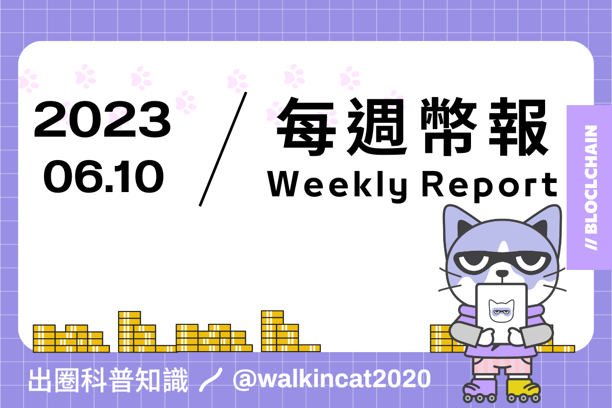

# 專案分析

- 無預挖、公平啟動的 FairERC20 協議是如何一夜爆紅的？
- 淺析 Frax Finance 的 frxETH V2 設計

# 觀點剖析
- 以 zksync 為例，探索新鏈時需要關注的 3 件事
- a16z 加密創業課：加密基礎設施的三種心智模型
- 代幣估值解析：如何運用框架判斷代幣價值
- Frontier Research：DEX 設計的下一步該如何改進

# 市場分析

- Vitalik 主張用原子交換取代跨鏈橋的方式是否可行？
- 了解 a16z 押注下一輪牛市的投資佈局
- Radiant Capital 會擊敗 Aave 和 Compound 成為新王嗎？

# 熱門事件
- SEC 起訴 Binance 關鍵點總結，沖冠一怒為求財？

----------------------------------------------------------------

# 無預挖、公平啟動的 FairERC20 協議是如何一夜爆紅的？

FERC20 是基於 ERC20 的代幣發行協議，透過結合 BRC20 去中心化的發行方式及 ERC20 智能合約的可編程性，可以讓以太坊上的代幣發行更加公平。

FERC20 有幾個主要的特點，包括沒有 owner 權限、沒有預挖機制、可以在 DeFi 生態中使用等，除此之外，FERC20 還添加了冷凍期、持倉條件、預售/眾籌等屬性來限制女巫帳號或是科學家影響代幣發行的公平性。

雖然 FERC20 協議的合約尚未被審計，且 FERC20 相關代幣的流動性也較低，仍有其風險性，不過 FERC20 能夠在短時間引起社群迴響的原因，無非是大家在 FERC20 身上真正看到了公平自由的理念，進而建立起對公平價值追求的共識，也讓加密的世界不再只是被技術或資本所掌握的遊樂場。

https://panewslab.com/zh/articledetails/2ifoejx3.html

# 淺析 Frax Finance 的 frxETH V2 設計

Frax Finance 最近推出了 frxETH V2 的設計方案，V2 的創新機制包括基於市場及利用率來作為基礎動態利率，以及可編程的借貸市場。

在 V2 中使用者可以根據貸款價值比（LTV）來借用並運行驗證器，但需先抵押超過 8 個 ETH 作為抵押品，借款的利息則從使用者的 ETH 和驗證者獎勵扣除，而 V2 也透過動態利率來讓節點運營者能有更靈活的選擇。

另外V2 在借貸市場的可編程性讓 veFXS 的持有者可以決定新的抵押品類型。透過這些創新除了提高 Frax 在借貸市場的效率和去中心化程度，也讓它在 LSD 賽道中變得更加與眾不同。

https://www.theblockbeats.info/tw/news/42420

# 以 zksync 為例，探索新鏈時需要關注的 3 件事

加密研究員 2Lambroz.eth 分享了他在探索新鏈時會注意的三個部分：早期流動性挖礦、早期代幣的風險和良好回報以及生態激勵。

早期流動性挖礦包括發行獎勵和真實收益，通常在交易量大於鎖倉量的情況下會是一個好的挖礦時機。

從早期代幣的風險及回報來看，投注生態中基礎設施 “第一個主要” 的協議會是不錯的機會。另外在生態激勵方面，作者認為最好的挖礦機會通常會是從鏈上得到激勵的協議。

最後作者也針對 zksync 目前的狀態建議使用者可以做的事，包括進行小規模的挖礦、尋找交易/挖礦激勵以及做空投獵人，並且也分享了他目前正在關注的項目。

> 如果能夠學會透過作者提供的方式來尋找新鏈生態的機會，你也能成功地吃到早期的生態紅利。

https://2lambroz.substack.com/p/3-things-to-look-for-in-a-new-chain

# a16z 加密創業課：加密基礎設施的三種心智模型

a16z crypto 的合夥人 Ali yahya 介紹了三種心智模型來幫助我們思考在建構 Web3 協議時應該考量的設計框架與核心概念，這三種心智模型分別是窄腰（narrow waist）、模塊化（modular）、網路飛輪（Network flyweel）。

窄腰模型套用在區塊鏈上可以促使多邊市場的出現，並透過共識機制來連接不同的參與者，建立起雙邊網路效應和正循環；模塊化模型因有其優缺點，必須依照具體狀況來決定模塊化程度；網路飛輪模型主要著重在代幣角色的作用，透過代幣激勵來解決冷啟動的問題，並藉此吸引資金和人力資源來增加網路效應。透過這些心智模型作為依據，未來開發者在開發協議時也能有更具體的思考框架來完成更優秀的協議設計。

https://panewslab.com/zh/articledetails/d0s0nm00c86g.html

# 代幣估值解析：如何運用框架判斷代幣價值

推文中作者教我們如何評估一個代幣的合理估值，首先可以從協議的手續費和收益以及市場份額等指標去了解協議的狀況，接著透過交易量和活動性的多寡來知道協議實際的使用率，並且進一步分析交易量是否為真實需求所產生。

我們也可以計算出價格和銷售的比例（P/S ratio）來比較協議的估值，得出的數字越小越好，作者也提醒，為了考慮到代幣在供需上的未來變化，在計算時用代幣的完全稀釋估值（FDV）進行計算會更好。 

除了上述的估值框架，也必須考慮到代幣的敘事、流動性、社群以及團隊等因素，才能更好的對一個代幣進行合理的評估，有了這些估值框架，我們就能從中尋找出具有潛力的代幣，進而有更好的投資機會。

https://twitter.com/ThorHartvigsen/status/1666503932171149312

# Frontier Research：DEX 設計的下一步該如何改進

本文作者探討了去中心化交易所（DEX）目前在設計上所面臨的問題，並提出了可能的解決方案。DEX 是 DeFi 的主要應用場景之一，但由於其與 CEX 相比不具競爭力的價格、易受濫用的 MEV 風險以及無法為流動性提供者良好的回報率等問題，使它們在交易量方面仍然大幅落後中心化交易所（CEX）。

因此作者提出了相對應的解決方案，在價格上可以透過預言機進行準確的定價以達到更好的報價；MEV 問題則可以藉由減緩交易結算速度並批量處理來降低 MEV 的風險；最後在流動性提供者的回報率上可以透過集中流動性來讓流動性保持在市場價格附近，提高 LP 的資金效率，甚至避免受到損失再平衡（LVR）的影響。

目前市場上已經開始有許多專案朝這些修正的方向前進，若能夠結合這些改進的設計，將能夠讓更多 CEX 的交易量與造市商願意到鏈上來，進而帶起 DeFi 上的繁榮。

https://frontier.tech/the-next-steps-in-dex-design

# Vitalik 主張用原子交換取代跨鏈橋的方式是否可行？

加密分析師 Ignas 針對 Vitalik 提倡的原子交換的代幣轉換方式進行深入的探討，原子交換的原理主要是透過哈希時間鎖合約（HTLC）來實行，並且是點對點的交易機制，交易的過程中沒有第三方的參與。原子交換相比跨鏈橋來說擁有不需信任第三方及代幣所有權控制等好處，Vitalik 過往也提出許多對於跨鏈橋的擔憂，不過原子交換尚不普及的原因主要有這幾個障礙，包括不同鏈有不同的腳本語言及共識機制、執行的複雜性和風險，以及對流動性的要求。

Ignas 舉了兩個可以直接把 ETH 直接換成 BTC 的 Dex 來說明，不過這兩個交易所的交易機制仍有其缺點，就目前的狀況來看，原子交換距離被大規模採用仍有一段距離，另外使用者在跨鏈資產的需求上在乎方便還是安全，這也將影響原生資產跨鏈的往後發展。

https://ignasdefi.substack.com/p/v-buterin-advocates-for-atomic-swaps

# 了解 a16z 押注下一輪牛市的投資佈局

推文中作者分享了 10 個 a16z 主要有投資的專案，這些專案類型包括了衍生品協議、全鏈、隱私、RWA、L2 以及碳融資等等，其中目前融資金額最多的前兩個專案就是 zksync 和 Layerzero，這兩個協議也是目前市場上擁有較多關注度的專案。

最後作者也提到 a16z 在 COMP、LDO、UNI、MKR、ETH、OP、SOL、AVAX 這些代幣上也都擁有相當大的持倉比例，從 a16z 的投資組合中可以看出他在加密市場中認為的未來趨勢與走向，而這些專案也是許多人認為很有潛力帶起下一輪牛市的敘事類別，不過過往 a16z 投資的專案中仍有失敗的案例，因此投資者仍必須保持理性的判斷而非盲目跟隨，並根據適當的投資依據做出合理的決策。

https://twitter.com/moomsxxx/status/1665772057907572736

# Radiant Capital 會擊敗 Aave 和 Compound 成為新王嗎？

Mechanism Capital 聯合創始人 Andrew Kang 認為 Radiant Capital 可能成為 Aave 和 Compound 的最佳競爭對手，Radiant 在跨鏈、安全抵押品和代幣設計方面有其優勢，並且提供的穩定幣收益率高達 10-40％，和 Aave 和 Compound 的 1-2% 相比之下相當有競爭力。

另外除了 RDNT 的 V2 Tokenomics 飛輪升級提高了其激勵儲備的價值，Radiant 90 天的收益也已經超越了 Aave、Compound，並且其市盈率和其他頭部專案幾乎一致，Radiant 社區的參與度表現也非常活躍。從上述的數據也能看出 Radiant 正在逐步發揮它的實力，未來能不能夠憑藉著其全鏈借貸的能力及相關的激勵措施鯨吞掉兩大借貸協議龍頭，值得我們持續關注。

https://www.techflowpost.com/article/detail_12126.html

# SEC 起訴 Binance 關鍵點總結，沖冠一怒為求財？

美國證券交易委員會（SEC）近日對幣安 CEO 趙長鵬（CZ）以及幣安和其他兩家子公司 BAM Trading Services 和 BAM Management US Holdings Inc. 提出了訴訟。 SEC 列出了 13 項指控，主要的指控重點包括幣安未經註冊的情況下非法提供交易所、經紀交易和清算等功能、非法銷售和發行未經註冊的加密資產證券、私下轉移客戶的資產等。

雖然 SEC 提出的訴訟屬於民事訴訟，但大家也都知道過去 FTX 與 SEC 主席 Gary Gensler 之間存在關聯性，SEC 這次對幣安提出訴訟是否參雜了某些私人因素不得而知，不過一些業內人士認為 SEC 的核心依然是希望從中獲得利益，不過這種藉由扼殺加密新創的手段來當作美國政府的盈利來源也受到許多人的抨擊，未來事件會如何演變以及對整個加密產業有何影響，還有待後續 SEC 與加密巨頭們如何進行這場拉鋸戰。

https://www.techflowpost.com/article/detail_12092.html

## 結尾

感謝您閱讀本篇文章，希望本文的內容能夠對您有所啟發和幫助。

如果您對區塊鏈出圈科普知識感興趣，請搜索 🔍 WalkinCat 走路貓，了解更多相關資訊。如果您想繼續關注我們的最新文章，歡迎訂閱我們的電子報，或透過以下連結找到我們。我們期待您的想法和反饋，謝謝您的支持！

> [歡迎訂閱走路貓](https://portaly.cc/walkincat)
>
