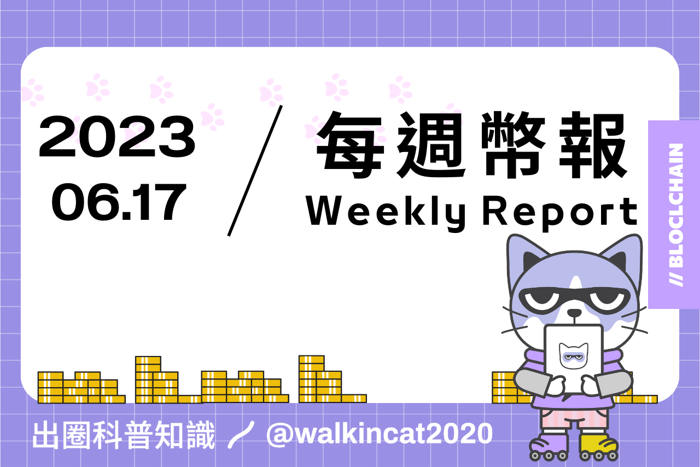

## 專案分析

- Uniswap V4：打破傳統 DEX 模式，成爲底層流動性基礎設施
- 解析幣安 Launchpool 新協議 Maverick：MAV AMM 如何提高資本效率？
- 快速了解遞歸銘文：Ordinals 的樂高積木
- Polygon 2.0 會成為下一個黃金敘事嗎？

## 觀點剖析

- Vitalik：要實現大規模落地，以太坊必須經歷 L2、錢包、隱私 3 個轉型
- 解密以太坊的擴展之道：探討 Rollups 的實際作用
- 以應用鏈為中心的發展路線如何避免重蹈 Polkadot 和 Cosmos 的覆轍？

## 市場分析

- Bankless：尋找更可持續的代幣模型
- 速覽 ETHGlobal 黑客松中值得關注的 5 個 GameFi 項目

## 熱門事件

- 當突發事件來臨，如何有效在鏈上對沖 USDT 的風險？

---

## Uniswap V4：打破傳統 DEX 模式，成爲底層流動性基礎設施

Uniswap 近期推出了 V4 版本，其中最大的特點就是引入 Hooks 和 Singleton 架構來實現可定制化的流動性池和交易成本的有效降低。

開發者可以透過 Hooks 插件來自定義與流動性池、交易、費用、LP 頭寸的交互，並制定出相應的功能，例如限價訂單、動態手續費，或是讓池子作為TWAMM（時間加權平均做市商）來使大型訂單可以隨時間分散開來。Singleton 的設計則是引入一個大的合約架構，讓所有的流動性都包含在單個合約中，進而降低整個 swap 過程的交易成本。

Uniswap V4 透過開放的架構設計為開發者帶來更大的彈性與可能性，V4 的推出也讓它擁有比 CEX 更好的優勢來拓展原本被 CEX 佔據的市場份額，更能夠成為整個流動性的核心基礎設施之一。
    
https://www.techflowpost.com/article/detail_12181.html

## 解析幣安 Launchpool 新協議 Maverick：MAV AMM 如何提高資本效率？

近期 SEC 對中心化交易所的打擊引發市場震盪，讓更多人開始思考 DEX 在未來加密貨幣市場中的價值和潛力，在這樣的背景之下，基於 ZKS 的 DEX 新星 Maverick Protocol 也因此備受關注。該協議結合了特殊的 LP 流動性方案、高效的資本利用率和自動化複投等優勢，以及對於協議安全性方面的重視，受到了巨鯨投資者的青睞。

Maverick 的代幣模型細節還不清楚，從 Binance Launchpool 的資訊中只知道 MAV 代幣可用於抵押及投票，並採用 Vetoken 的模型。Maverick 投資方包括 Peter Thiel 的創始人基金、Pantera Capital、Binance Labs、Coinbase Ventures 等。 Maverick Protocol 目前的 TVL 約 3300 萬美，雖然與 Uniswap 相比有落差，但其資本效率排行卻是第一，可以看出該協議完美發揮其優勢，未來或許能在 DEX 的紅海中殺出重圍。

https://twitter.com/Rocky_Bitcoin/status/1668714755635429377

## 快速了解遞歸銘文：Ordinals 的樂高積木

比特幣協議 Ordinals 近日推出了一種名為 “遞歸銘文” 的新功能，可以透過特殊語法引用其他銘文，從而降低創建銘文的成本和手續費。

與傳統需要上傳圖片並在鏈上下載圖片的方式相比，遞歸銘文藉由使用文字代碼來找尋和組合已存在於比特幣鏈上的元素，使得銘文大小大幅降低，同時也為銘文創作拓展了更多的可能性，例如藉由可組合及可拆分性創造出二次銘文，或是將 GitHub 的代碼數據搬遷至鏈上來實現完全的去中心化，而其特性也讓在比特幣鏈上創建動態網站的可能性得以實現。

雖然這樣的技術出現將為比特鏈上帶來更多的創新應用及無限想像，不過新技術也伴隨著不確定和未知的風險，因此還是需要抱持謹慎的心態來面對新技術的誕生。

https://mirror.xyz/0x901eA9e4c3D637C73a368B2bCD0E708992baE49C/edtWap72wgcJ8LAQ31v34xEZVHfPwU3IRD340buTxjQ

## Polygon 2.0 會成為下一個黃金敘事嗎？

推文中作者針對 Polygon 即將推出的 Polygon 2.0 進行解說與分析，Polygon 2.0 是 Polygon 網路的一系列升級，旨在提高可擴展性、安全性和去中心化程度。Polygon 2.0 將包括新的 PoS 共識機制、新的數據可用性層和新的去中心化身份層，另外在跨鏈協調方案上， Polygon 2.0 預計會採用 Zk 跨鏈橋中繼層的通用方案來實現。

Polyagon 也在發布消息中預告了其代幣經濟學可能也會有進一步的升級，不過目前 Polygon 代幣面臨著 SEC 監管以及代幣持有人的壓力，作者也對接下來可能施行的代幣政策調整進行預測與分析。雖然 Polygon 近幾年看似不像其他專案一樣引人注目，不過卻已經默默拿下了許多與 Web2 企業的合作機會，或許 Polygon 能夠成為下一輪敘事中一鳴驚人的主角。

https://twitter.com/0xNing0x/status/1668601397171089408

## Vitalik：要實現大規模落地，以太坊必須經歷 L2、錢包、隱私 3 個轉型

Vitalik 在文章中說明以太坊需要經歷三個技術轉型，才能成為一個成熟且易於使用的技術，這三個對以太坊成功至關重要的轉型分別為：L2擴展、錢包安全和隱私，Vitalik 也針對這三個部分分別討論了其技術轉型的原因與必要性。

Vitalik 也提到了在 Zuzalu 上基於 ZK-SNARK 的身份系統 Zupass，用戶可以透過私鑰來驗證身份並進行基本的證明，目前值得注意的應用程式有 Stamp （Zupass 版的 POAP）。最後文章中強調了保持事物去中心化和對用戶易於理解的重要性，以及在可擴展性、錢包安全性和隱私挑戰對於確保以太坊未來至關重要。

https://www.panewslab.com/zh/articledetails/ri63mm3r.html

## 解密以太坊的擴展之道：探討 Rollups 的實際作用

Rollups 和 L2 技術目前被認為是提升以太坊擴展性的解決方案，推文中作者提到直接加快 L1 的速度來進行擴展並不可行，因為這會導致 L1 節點的同步變得困難，作者也針對 Optimistic Rollups 和 ZK Rollups 的基本原理進行解說。

Optimistic Rollups 是在以太鏈上存儲所有交易和最終狀態來減輕了 L1 節點的負擔，並依賴誠實的 L2 節點來讓網路其他節點達成正確的狀態，而 ZK Rollups 則利用數學算法產生難以生成但容易驗證的證明，從而在 L1 上驗證大量的 L2 交易。

最後作者也提到雖然 Rollups 可以使交易成本更加便宜，但在使用 Rollups 仍然需要權衡關於安全方面的取捨，才能達到合理的擴展狀態。

https://twitter.com/krzKaczor/status/1668991207391866882

## 以應用鏈為中心的發展路線如何避免重蹈 Polkadot 和 Cosmos 的覆轍？

目前很多區塊鏈都朝著以應用鏈為核心的擴展方向發展，但是在這個轉變中作者認為其中存在一些問題。一方面是專案的行銷宣傳和其實際情況有落差；另一方面大家認為應用鏈才能有效的擴展，因此需要去找到如何保護應用鏈並實現它們之間互通的方法。

應用鏈希望擁有類似 Polkadot 和 Cosmos 的安全性和功能，但要將它們整合進現有的協議中十分困難，並且也不希望透過這些原生代幣來保護應用鏈本身和互操作的通道。因此可行的解決方案是利用多個基礎層來作為訊息的傳遞中心，並讓應用鏈使用基礎層的代幣來確保其鏈上的安全。

不過這種方法也面臨著成本和狀態感知的挑戰，儘管目前還沒有找到完美的解決方案，但我們可以透過理解第一代應用鏈創建者他們所做的設計選擇和權衡上的考量來避免新一代應用鏈重蹈覆轍。

https://twitter.com/MylesOneil/status/1668985862720221191

## Bankless：尋找更可持續的代幣模型

本文介紹了 DeFi 中流動性之於專案的重要性，以及如何設計一個可持續的代幣模型來吸引更多用戶並維持著其流動性。目前多數的專案採用流動性挖礦的做法，雖然在短期內對用戶具有吸引力，但長時間這樣的模式並無法持續，因此需要設計出更吸引人，並且鼓勵用戶長期參與的代幣模型，才能持續地保留並增長流動性。文章中介紹了 LP Gauge Tokenomic、期權流動性挖礦以及 Berachain 協議的不同代幣模型，並探討了它們如何優化現有的流動性狀態。

流動性是許多 DeFi 協議存亡的關鍵，除了藉由深入了解不同的流動性設計方式來判斷協議在市場上的競爭力，了解協議的收益來源以及收益的可持續性也會是在 DeFi 中尋找穩健收益的重要因素之一。

https://www.techflowpost.com/article/detail_12189.html

## 速覽 ETHGlobal 黑客松中值得關注的 5 個 GameFi 項目

作者在 ETH Global 的黑客松活動中挑選出 5 個他認為值得關注的 GameFi 專案，這些專案都是透過鏈上遊戲引擎（MUD）來打造其鏈上遊戲，這 5 個專案包括：

1. Pledger：遊戲以玩家的公開承諾為核心，玩家進行承諾並證明其確實完成，進而從其成就中贏得遊戲中的聲譽。
2. Autonomous Game of Life：用 MUD V2 建構的去中心化且多玩家的鏈上康威生命遊戲。
3. Trade Wars：鏈上的互動式2D遊戲，允許在自治且位置綁定的AMM經濟中進行海上商貿、戰鬥和資源套利，玩家會透過鏈上的攻擊系統進行戰鬥。
4. OPCraft2：此款遊戲以 Minecraft 中的紅石概念作為延伸，並可以像 Minecrafe 一樣讓玩家建構複雜的電路。
5. Muttendo：Muttendo 可以讓玩家在短時間內遊玩復古的任天堂遊戲，並且每次短暫的遊戲過程中會創建檢查點，其他玩家可從任意的檢查點開始遊戲。

這些能得獎的鏈上遊戲都有其獨特性，或許相對傳統 Web2 遊戲的遊戲性仍有落差，但逐步成熟的鏈上遊戲生態將有可能帶領 GameFi 重新進入新的 StepN 時代。

https://twitter.com/0xsurferboy/status/1666994627294142464

## 當突發事件來臨，如何有效在鏈上對沖 USDT 的風險？

穩定幣 USDT 在 6/15 突然無預警的脫鉤引起市場恐慌，而脫鉤也導致 Curve 3pool 池的穩定幣比例嚴重傾斜，因此作者透過實際操作教我們如何在這樣的情況之下有效的對沖掉風險，保障資金的安全。

用戶可以到 Aave 和 RDNT Capital 市場中抵押波動性小的穩定幣如 USDC，並借出 USDT，再將 USDT 兌換成其他穩定幣，又或是用槓桿空投的方式來進行對沖。

雖然目前 USDT 已恢復其原本的價格，不過在 Curve 3pool 池中的比例仍未恢復平衡，投資者在面對這種突然的市場事件，學會採用相應的措施來對沖風險，才能在險峻的市場中存活得更久。

https://www.techflowpost.com/article/detail_12192.html

## 結尾

感謝您閱讀本篇文章，希望本文的內容能夠對您有所啟發和幫助。

如果您對區塊鏈出圈科普知識感興趣，請搜索 🔍 WalkinCat 走路貓，了解更多相關資訊。如果您想繼續關注我們的最新文章，歡迎訂閱我們的電子報，或透過以下連結找到我們。我們期待您的想法和反饋，謝謝您的支持！

> [歡迎訂閱走路貓](https://portaly.cc/walkincat)