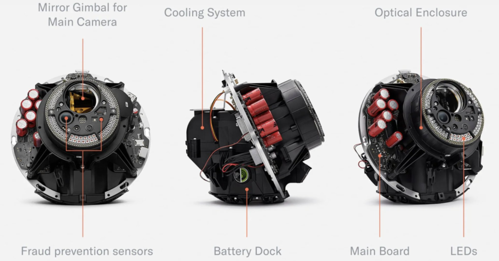
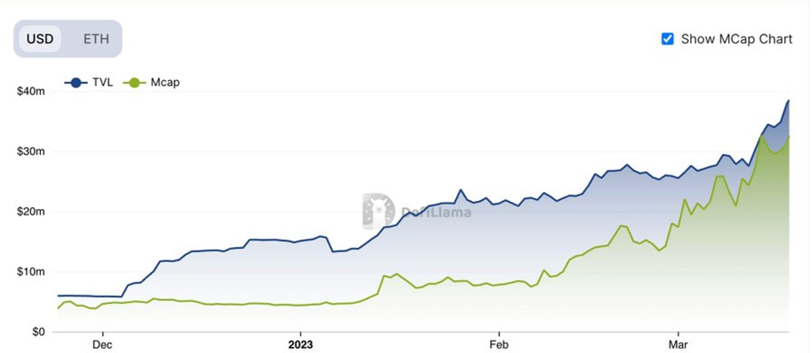
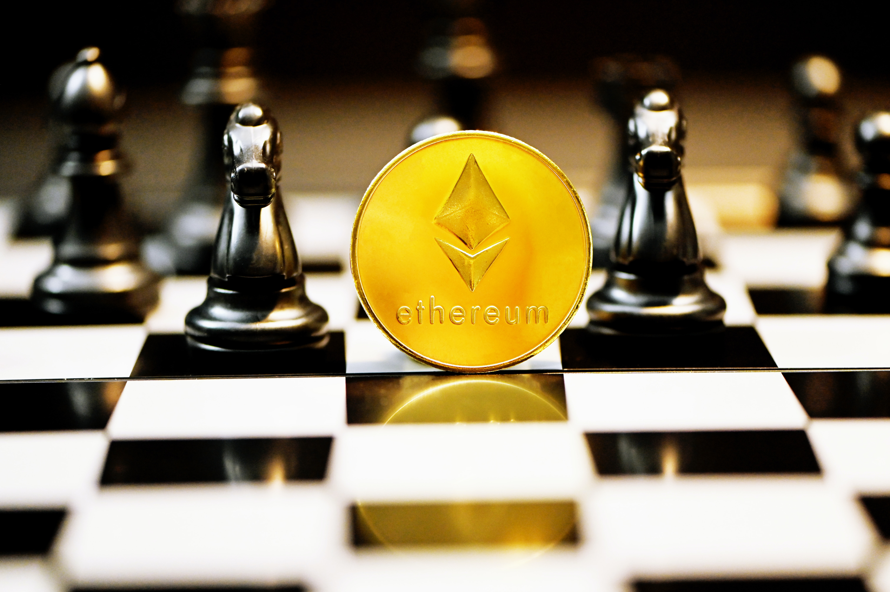
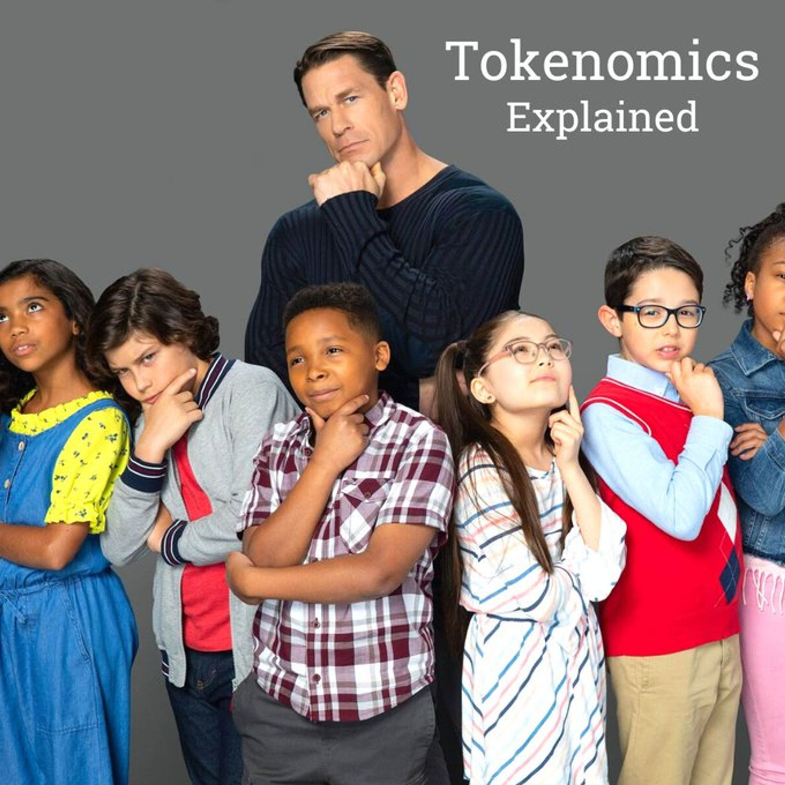
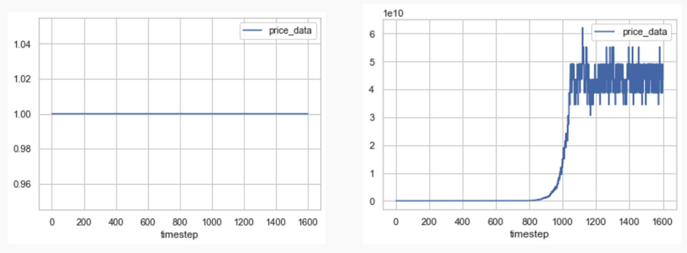
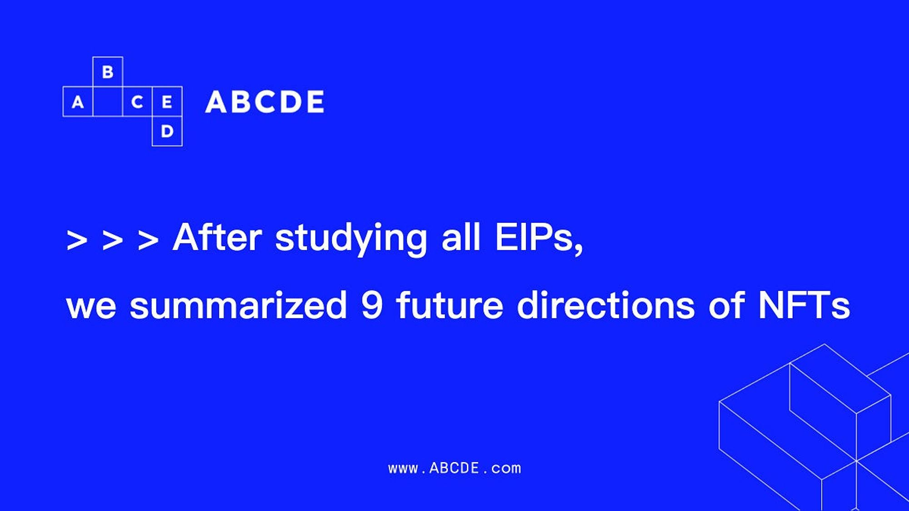

## 專案分析

- OpenAI 創辦人計劃的 Worldcoin 能否成為撼動金融經濟界的 ChatGPT ?
- 帶你深入淺出了解利率交易平台 Pendle 的機制
- BeraChain 能否成為 Layer1 的新生代黑馬？

## 觀點剖析

- Vitalik 教你如何正確選擇多簽錢包及社交恢復錢包的守護者（Guardians）
- 小學 5 年級也能懂的代幣經濟學全指南
- 以太坊的上海升級將為 Staking 帶來怎樣的未來？

## 市場分析

- EIP-4844 費用市場分析
- 透過 NFT 的創新提案一覽 9 個 NFT 未來的敘事方向
- 頂級公鏈及其生態估值模型的探討性分析

## 熱門事件

- 錯過 Arbitrum 空投列車？不要再錯過這 10 個值得關注的空投機會

--

## OpenAI 創辦人計劃的 Worldcoin 能否成為撼動金融經濟界的 ChatGPT ?

Worldcoin 是由 OpenAI 創辦人 Sam Altman 於 2020 年成立的加密貨幣專案，藉由建立一個全球化的金融網路，讓每個人都能享有進入全球經濟的權利，並將普惠金融的概念帶給全世界。Worldcoin 是一個開源協議，由開發人員、經濟學家和技術專家共同開發與發展，預計於 2023 年上半年正式推出，這個專案主要由三個要素所構成，包括由虹膜辨識所建立的個人隱私數位身分 World ID，免費向全球分發的 Worldcoin，以及可以進行支付、購買、轉帳的 World App。

Worldcoin 預計向 10 億人發起空投，最主要是要讓更多的人能夠參與這個全球的經濟生態，為了避免讓大量虛假的帳戶來影響空投計畫，Worldcoin採用虹膜掃瞄的生物辨識設備來驗證每個人的真實性，並透過零知識證明來確保隱私。未來 Worldcoin 會逐漸落實去中心化的治理及營運，並真正發展成一個實踐區塊鏈精神的全球項目，在 OpenAI 後 Ｗorldcoin 會不會再次帶來人類史中的重大變革，大家可以拭目以待！

- [連結](https://twitter.com/jason_chen998/status/1637845333056294913?s=20)

## 帶你深入淺出了解利率交易平台 Pendle 的機制

Pendle是一個利率交易平台，主要是透過把原本在 DeFi 的抵押生息資產（SY）拆分成 PT（本金代幣）和 YT（利息代幣）， PT 和 YT 的價格是由算法參數構成的 AMM 流動性曲線來定價，由市場供需來決定。

使用者可以將 SY 換成 PT 來鎖定固定期間內的利率，而換成 YT 則是在用槓桿方式來打賭利率會上漲，其中的隱含利率會是影響 YT 收益的因素，當 SY 的實際利率大於隱含利率，YT 收益則會是槓桿化的超額利率；

若 SY 實際利率小於隱含利率，則 YT 收益將會呈現虧損。Pendle 的 AMM 核心概念在於到期時間越長，流動性分佈會越寬，反之時間越短，分佈則越集中，並且流動性的集中點會落在 SY 當前實際 APY 的位置。

雖然 Pendle 在利率的確定性和賭性上設計的機制算是完善，但代幣目前的價值捕捉能力還不足，不過利率交換市場隨著生息資產的可持續性增加而從中受益，只要 Pendle 能夠繼續優化並站穩腳步，或許未來能成為利率交易市場的第一把交椅。

- [原文連結](https://twitter.com/NintendoDoomed/status/1637025920102940672)

## BeraChain 能否成為 Layer1 的新生代黑馬？

Berachain 是一個建立在 Cosmos 上兼容 EVM 的 Layer 1 區塊鏈，並且由流動性證明共識所驅動，目前他們的社群規模已發展出一定規模並且越來越龐大，Berachain 主要是由 $BERA（Gas token）、 $BGT（governance token）、$HONEY（stablecoin）三種代幣結構所構成。

他們最近推出了與 Cosmos EVM 兼容的區塊鏈框架 Polaris，並且已有許多項目在 Berachain 上建立，雖然還沒確定是否會有空投計畫，不過作者認為有很高的可能性，因此可以透過幾個方法來交互，最直接的方法就是購買 Berachain NFT rebase，有傳聞代幣的 5％ 將分配給 NFT 持有者，另外也可和幾個在 Berachain 上的專案進行交互以獲得潛在空投機會。這個不同於其他 Layer1 區塊鏈的網路驗證方式能否在眾多專案中脫穎而出，成為公鏈中的潛力黑馬，一切待其主網上線後將會慢慢揭曉。

- [原文連結](https://twitter.com/kindahangry/status/1636351655993311232)

## Vitalik 教你如何正確選擇多簽錢包及社交恢復錢包的守護者（Guardians）

以太坊創辦人 Vitalik Buterin 針對如何在多簽錢包及社交恢復錢包上來選擇「守護者」（Guardians）提出他的見解，文中寫到思考如何安全使用這兩種錢包的安全關鍵問題在於要選誰作為守護者以及要給守護者什麼樣的提示。

在選擇守護者時應該要最小化他們的相關性避免他們同時癱瘓或遭受威脅而妥協，例如最好找彼此不認識的或是在守護者批准任何操作前須先詢問與你有關的安全問題，最後，至少每年對所有守護者進行一次測試避免他們丟失或忘記帳戶。雖然目前尚未有使用者對於守護者財務隱私上保護的技術，不過 Vitalik 認為這個問題未來可以透過鎖盒（Lockbox）和 ZK-SNARK 技術來解決。

- [原文連結](https://old.reddit.com/r/ethereum/comments/11tijiv/how_i_think_about_choosing_guardians_for_multisig/)

## 小學 5 年級也能懂的代幣經濟學全指南

代幣經濟 （Tokenomics）顧名思義就是管理代幣的經濟和財務原則，裡面主要包含兩個面向：供應與需求，在這兩個主要的面向中又各自包含不同的要素，供應面上會有關於代幣釋放、通貨膨脹或緊縮、銷毀、分配歸屬、代幣供應類型以及市值等因素來影響，通常有些代幣會搭配銷毀的方式來減少代幣供應，達到通貨緊縮的效果，進而提升代幣的價值；而在需求面上則會由投資回報率、代幣效用、迷因狂熱等因素來驅動代幣的需求，不同種類的專案也會賦予代幣不同的功能，例如必須購買代幣來遊玩遊戲，或是將代幣視為服務提供的驗證標的。只要投資人能夠好好了解不同專案在代幣經濟上的設計邏輯，便能夠對專案的好壞與有能有更深一層的判斷。

- [原文連結](https://twitter.com/ruyan768/status/1634672950514425856)

## 以太坊的上海升級將為 Staking 帶來怎樣的未來？

眾所矚目的上海升級即將在 4 月到來，目前已在 Goerli 測試網上面進行測試，這次的升級將會開放原本質押者提領質押在以太坊鏈上的以太幣，當質押代幣可以被順利提領，也代表著在以太坊成為質押者的風險其實是比過往小很多。作者藉由關注參與度與安全資本化這些關鍵指標來了解上海升級前指標之間的相關性及前後變化。當前流動性質押協議加上中心化交易所的四大實體就佔了總質押存款超過半數比例，這也讓這些質押提供商的中心化問題被討論，而 DVT 就為這個問題帶來新的解法。最後作者也提到目前的流動性質押服務提供商的競爭狀況以及升級後對以太坊通脹率的影響，隨著以太坊達成這個重要里程碑，除了會為質押賽道重新開啟新的篇章，也能讓更多人能一起參與以太坊安全性的擴增。

- [原文連結](https://www.ethereum.cn/Eth2/The-Future-of-Staking)

## EIP-4844 費用市場分析

EIP-4844 最大的創新就是為 L2 的數據傳輸專門設計一個 “blob-carrying transactions” 的交易類型，並且帶來一個新的數據 Gas Fee 市場。文章中主要探討 EIP-4844 和 EIP-1559 兩者協議的 Gas Fee 機制關係和其中的交互作用，以及透過歷史數據回測來分析可能的改進方案。目前以太坊的 Gas Fee 市場有兩種，一種是單維度的標準交易型（EIP-1559），另一種是雙維度的 Blob 交易型（EIP-1559 x EIP-4844），使用者可自行決定要使用哪種交易類型。

作者在 L2 的數據回測上也發現幾個問題，包含數據 Gas Fee 的價值發現時間長，過分低廉的數據 Gas Fee 會讓無用的交易佔用 Blobs，以及會讓 Rollups 和應用程式做出對數據 Gas Fee 的錯誤假設，另外從圖表也可看出，數據預計需求達到可持續目標前，數據 Gas 價格會幾乎維持在最低值；一旦需求達到可持續目標，價格則會呈現指數上升。上述的問題作者提出可以透過設定較高的合理最低數據 Gas Fee 來預防無用交易的佔用，或是將每個區塊的 Blob 數量調降為 1 個來減少長時間的價格發現期來解決，不過後續也都要等上海升級啟動後才能知道 Blob 的數據 Gas Fee 市場的真正發展。

[https://ethresear.ch/t/eip-4844fee-market-analysis/15078](https://ethresear.ch/t/eip-4844-fee-market-analysis/15078)

## 透過 NFT 的創新提案一覽 9 個 NFT 未來的敘事方向

ABCDE 是一個主要投資加密貨幣發展的基金，他們透過研究許多 NFT 相關的 EIP 提案，得出幾個未來 NFT 領域上可能會有的發展方向，包含權限啟用、關係啟用，以及作為分期歸屬工具、身份代幣、實物資產、EOA 等等的功能領域發展，在 NFTfi 的市場上也能因為這些更精細的機制體現出更多面向的價值評估。雖然 NFT 的熱度隨著去年市場的冷卻也逐漸降溫，不過相信隨著 NFT 在功能提案上的逐漸推進，未來大家對於 NFT 能夠打開更大的想像空間，並透過在各方向的創新結合，再次重新引領新時代的 NFT 風潮。

- [原文連結](https://medium.com/@ABCDE.com/abcde-after-studying-all-eips-we-summarized-9-future-directions-of-nfts-648c11f16a4f)

## 頂級公鏈及其生態估值模型的探討性分析

本文主要針對行業認知參數和公鏈估值體系進行探討，作者從另一個角度來分析數據的估值模型，透過比較各個非 ETH 智能合約平台牛熊期間的 PMC（Public Market Cap）和 EMC（Ethereal Market Cap）的比值 （PE），得出其常態化的區間範圍約落在 6%-20%。

因現在多數的區塊鏈專案獲得機構投資較多，流通比例較少，故將 Market Cap 和以太坊的比值改成用 FDV 來計算，並藉由上述的估值範圍，來衡量新專案的合理估值。另外作者也從常規 DEX 和所屬公鏈的 FDV 比值（DP）得出常態化區間約在 1%-3% 的範圍。

每條公鏈都會有一個主流 DEX 和它相對應，因此可以藉由這個比值範圍去找出哪個 DEX 或許有相對的發展空間，以及哪些已經達到上限，可以適時將其兌換成其所屬公鏈。後續或許也可將這樣的估值邏輯延伸至不同的賽道，並從中找到更多的潛在機會。

- [原文連結](https://pima09.substack.com/p/4ca)

## 錯過 Arbitrum 空投列車？不要再錯過這 10 個值得關注的空投機會

加密分析師 Miles Deutscher 整理了他認為接下來有可能也會進行空投計畫的 10 個專案，這些專案分別為 LayerZero、zksync、Scroll、Sui Network、Starknet、Shardeum、Lens Protocol、Fuel Network、Sei Network、Metamask。

他也提出一些方法可以有技巧性地進行空投交互，首先要先選擇真正想交互的區塊鏈專案，唯有能夠享受這個過程，才有辦法堅持做下去。接著必須透過組織化的系統來執行這些任務，每個禮拜撥出一小段固定時間來進行，並且使用 Discord，可以將要關注的專案一起放在 Discord 的資料夾內，這樣就不會錯過專案的最新消息，在這些過程中也不要對會有空投的想法抱有過度期望，不過你花的時間和金錢是有可能得到巨大的回饋。

最後，盡量去探索專案內的生態系統，生態系統中許多協議也有可能會是具有空投計畫的專案。Arbitrum 空投讓過去願意花時間在鏈上的人得到了相對應的甜美果實，若是不小心錯過這次的空投奪甕，不仿找時間一一去了解這些潛在空投專案並且試著進行鏈上操作，或許下次你也會是滿載而歸的空投獵人！

- [原文連結](https://twitter.com/milesdeutscher/status/1639030835478409216)

# 結尾

感謝您閱讀本篇文章，希望本文的內容能夠對您有所啟發和幫助。

如果您對區塊鏈出圈科普知識感興趣，請搜索 🔍 WalkinCat 走路貓，了解更多相關資訊。如果您想繼續關注我們的最新文章，歡迎訂閱我們的電子報，或透過以下連結找到我們。我們期待您的想法和反饋，謝謝您的支持！

- [訂閱走路貓](https://portaly.cc/walkincat)