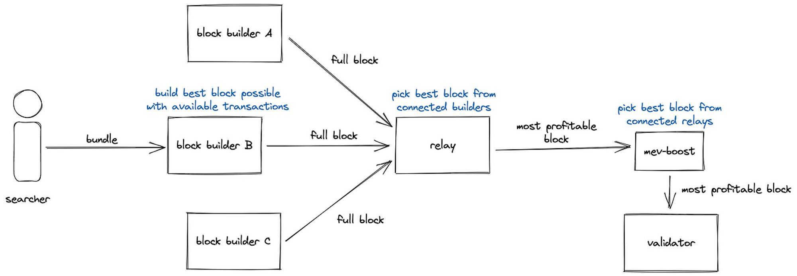

## 專案分析
- 3 分鐘讀懂 Circle 推出的跨鏈傳輸協議 CCTP

## 觀點剖析

- 比特幣的 L2 到底是洪水猛獸還是潛在的 Alpha？
- 從技術角度提出對零知識證明的批判，市場忽視了哪些缺點？
- a16z : “Tokenology” —— 超越代幣經濟學
- Meme 幣終極指南：帶你找到下一個 meme 幣的爆發機會
- 尋找百倍幣項目底層邏輯和賽道思考

## 市場分析

- 了解在 Bytecode 和語言層級兼容之間的 zkEVM 差異
- DVT 或許會是以太坊最不容忽視的敘事之一
- MEV 賽道會是下一個 LSD 級的機會？

## 熱門事件
- Ordi 代幣引燃比特鏈上發幣潮，手把手教你如何鑄造出 BRC20 代幣

    
    ## 3 分鐘讀懂 Circle 推出的跨鏈傳輸協議 CCTP
    
    美元穩定幣發行方 Circle 宣布推出 USDC 跨鏈傳輸協議（CCTP），目前僅支持以太坊及 Avalanche，預計今年底將會擴展到其他鏈上。協議透過銷毀原始鏈上的代幣並在目標鏈上鑄造新的代幣以實現Web3 中的流動性統一，並且進而簡化用戶體驗。CCTP 為無需許可的基礎設施，可以構建或集成到現有的應用程序、錢包和跨鏈橋接器中使用。目前 Metamask、5 個橋和 10 個不同合作夥伴的 SDK 已經和 CCTP 進行集成。 CCTP 未來會不會對於其他跨鏈橋造成影響，相信市場會慢慢證明給大家看。
    
    [https://panewslab.com/zh/articledetails/tmyl8q3g.html](https://panewslab.com/zh/articledetails/tmyl8q3g.html)
    
    
    
    ## 比特幣的 L2 到底是洪水猛獸還是潛在的 Alpha？
    
    比特幣的 L2 早在2018 年閃電網路上線後就已存在，因為比特幣網路不支持智能合約，因此催生了能夠支持智能合約的比特幣 L2。目前市場上有兩種途徑可以獲取 BTC 的 DeFi 收益，一種是透過中心化機構在其他網路發行錨定 BTC 代幣參與，另一種則是透過比特幣側鏈／L2 發行去中心化程度較高的 BTC 錨定代幣來進入 DeFi 的應用場景。而 BTC 在實行資產跨鏈時必須依賴一群特權角色來進行跨鏈的交易驗證，因此這些特權角色是否夠去中心化會是影響資產本身安全性的因素之一，另外跨鏈 BTC 所基於的鏈也是影響安全性的關鍵因素，Stacks L2 因其結算層在比特幣，安全層級會比其他在不同鏈上的方案來的高。比特幣在 DeFi 中的成長潛力相比於以太坊存在著非常大的想像空間，畢竟整個加密貨幣市場最大的資金規模仍在比特幣上，若能將比特幣完整地透過 L2 的方式來將其帶入 DeFi 應用，將有機會迎來屬於比特幣的 DeFi Summer。
    
    [https://twitter.com/y_cryptoanalyst/status/1644691339840458753](https://twitter.com/y_cryptoanalyst/status/1644691339840458753)
    
    
    
    ## 從技術角度提出對零知識證明的批判，市場忽視了哪些缺點？
    
    作者主要批評了在零知識證明技術（ZK）上的兩個問題：證明時間長和系統安全性需要測試。 ZK 是區塊鏈領域非常流行的技術，可以在鏈下進行計算，但證明生成時間過長是一個普遍存在的問題。為了解決這個問題，研究者和開發者提出了各種解決方案並進行大量基準測試。其中，批處理和遞歸方法可以並行驗證多個證明，硬件加速可以減少物理和節點層面的證明時間。同時，ZK 的系統安全性也需要測試和審計，特別是對於龐大的 ZK 應用程序。為了確保 ZK 系統安全，可能需要採用形式驗證等安全工具或其他安全相關工具。
    
    [https://www.panewslab.com/zh/articledetails/rb60f1sk.html](https://www.panewslab.com/zh/articledetails/rb60f1sk.html)
    
    
    
    ## a16z : “Tokenology” —— 超越代幣經濟學的新概念
    
    本文主要針對代幣在加密貨幣和 Web3 領域中的重要性和應用進行討論。代幣在區塊鏈中的設計空間非常寬廣，涉及多個領域，如藝術、經濟學、設計、心理學等。作者認為，“代幣經濟學” 這個詞無法全面傳達代幣的維度和設計空間，因此提出了 “代幣學” 的概念，指的是如何透過使用密碼學和機制設計來協調人、組織及計算來實現共同目標的 “研究”。
    
    代幣在區塊鏈中具有重要作用，如實現所有權、一致性、激勵結構、獲取商品和服務等功能。代幣不僅在經濟背景下有用，也可以在經濟背景之外發揮作用，開發者應該要能夠使用新的代幣設計將隱性價值變為顯性價值。無論是稱之為 “代幣學” 還是其他術語，它都是代幣、經濟學、藝術等維度的結合。
    
    [https://news.marsbit.co/20230422130937677571.html](https://news.marsbit.co/20230422130937677571.html)
    
    
    
    ## Meme 幣終極指南：帶你找到下一個 meme 幣的爆發機會
    
    作者從以下幾個面向來引導大家如何進入迷因幣的世界，包括買賣的地方、滑點解釋、如何查看圖表、如何避免貔貅合約（只能買進不能賣出），以及如何追蹤這些迷因幣。在 DEX 中交易時，必須注意滑點的設置，如果代幣無額外手續費，則滑點限制在 2~3％ 即可，避免遭受 MEV 機器人攻擊。另外可以透過 [honeypot.is](https://t.co/lowAKQV6Q2) 這個網站查詢代幣合約是否為貔貅合約，若想追蹤錢包或代幣的動態，可以新增這個追蹤機器人（[t.me/etherdrops_bot](https://t.co/qzSkgTeaaH)）。有了這些指示及工具，玩家可以在迷因幣的領域更得心應手，並且避開許多風險，不過還是得考量自身的風險評估，永遠保持理性投資。
    
    [https://twitter.com/serpnofomo/status/1649814882781483008](https://twitter.com/serpnofomo/status/1649814882781483008)
    
    
    
    ## 尋找百倍幣項目的底層邏輯和賽道思考
    
    Web3 正在改變社會生產遊戲規則，與 AI 共同制定新的世界商業秩序。AI 是新生產力，Web3 是新生產關係，用戶數據是新生產資料。在這個變革中，要思考哪些是必須存在、必然要搭建和現在缺失的部分。
    
    AI 替代生產力中的要素，如勞動者、勞動資料和勞動對象。因此，Web3 成為新生產關係，主權個人化。在新的生產關係中，擁有更高效率，沒有雇傭合同，只有智能合約；沒有上下級關係處理，只有任務導向。
    
    理解這些邏輯後，可以發現新的價值點，如 DeFi 3.0 創新、AI 渲染、去中心化技術等。在尋找百倍幣時，要分辨真正有價值的項目和偽命題。
    
    [https://twitter.com/Rocky_Bitcoin/status/1651261347999670272?s=20](https://twitter.com/Rocky_Bitcoin/status/1651261347999670272?s=20)
    
    
    
    ## 了解在 Bytecode 和語言層級兼容之間的 zkEVM 差異
    
    目前加密領域中這四種 zkEVM 項目：Scroll、Polygon、zkSync 和 Starknet 正在塑造以太坊的可擴展性未來，不過，這些其實都不是與 ETH／EVM 等效的，作者希望大家能夠在 Web3 領域中精確的使用這些術語，以避免混淆。文中指出多數的 zkRollups 因其應用 zk 技術的簡潔性，應該被稱作 Validity Rollups 較適當，其中也講解了 Bytecode 兼容性和語言級別兼容性兩種實現 EVM 兼容性的方法，作者認為項目必須在安全性和選用的工具之間做出權衡，因為語言級別上的兼容性更增加了不同面向的複雜性。最後從文章中的解釋也可了解到 ETH 等價、EVM 等價、Bytecode 兼容性和語言級別兼容性其實都是不同的概念，未來在了解這項技術時對於不同術語間的使用也能更加清晰。
    
    [https://twitter.com/0xSalazar/status/1647906690115796992](https://twitter.com/0xSalazar/status/1647906690115796992)
    
    
    
    ## DVT 或許會是以太坊最不容忽視的敘事之一
    
    從去年的以太坊實施合併後，整個 LSD 的生態開始蓬勃發展，而在近期的以太坊上海升級完成後，LSD 賽道更是快速擴張，雖然以太坊開放提領功能，不過因爲其質押數量的限制，多數的散戶還是選擇 Staking-as-a-Service、Pooled Staking 和 CEX 作為賺取質押收益的管道，卻也讓這些服務反而掌控了大部分的質押市場，這種權力集中的情形對以太坊生態系統埋下了長期的擔憂。
    
    因此 Vitalik 提議透過 DVT（分布式驗證技術）來實現流動性抵押協議的去中心化，目前市場上已有許多專案致力於實現這個目標，未來 DVT 或許會是所有流動性質押協議的主要核心集成，也會是以太坊持續健康發展最不可或缺的元素之一。
    
    [https://twitter.com/mrjasonchoi/status/1649401355784826881](https://twitter.com/mrjasonchoi/status/1649401355784826881)
    
    
    
    ## MEV 賽道會是下一個 LSD 級的機會？
    
    文章中主要針對 MEV 和 MEV-Share 進行較深入的分析，MEV 是指驗證者透過操縱交易順序所能提取的最大價值。 Flashbots 推出 MEV-Share 後將有助於解決用戶在 DEX 交易中常發生的三明治攻擊及滑點等問題。 MEV-Share 允許用戶將交易訊息提供給 Flashbots，這筆交易帶來的 MEV 收入會返還 90% 給原用戶，也因為 Flashbots 擁有獨家的交易訊息，比其他人有更大的獲利空間。自Merge 以來，以 MEV 收入為主的比例就佔了 Staking 總收益約三分之一，甚至由 Flashbots 提交的區塊數量佔比更是將近一半，雖然 Flashbots 還有許多問題尚待解決，不過目前都還在初始階段，MEV 將會是帶領以太坊進入另一個 LSD 等級的潛力賽道。
    
    [https://capitalismlab.substack.com/p/mev-lsd](https://capitalismlab.substack.com/p/mev-lsd)
    
    
    
    ## Ordi 代幣引燃比特鏈上發幣潮，手把手教你如何鑄造出 BRC20 代幣
    
    本文主要介紹在比特幣原生鏈上發行的同質化代幣協議 BRC20，BRC20 是一種借鑑於 ERC20 的實驗性代幣標準，主要是透過 Ordinal JSON 數據來創造及轉移代幣，而 Ordi 則是第一個基於 BRC20 協議的代幣，總量共 2100 萬個。作者透過一步步的實際操作，帶領玩家如何使用 UniSat 錢包和 idclub 等鑄造工具進行實時查詢和鑄造銘文，也讓更多人能夠透過操作的過程，親自參與這場由 Ordi 所帶起來的比特幣代幣新風潮。
    
    [https://mirror.xyz/0lscan.eth/wLRq59UT7_liWtgVQaaAltIyz2gzhM-GIVWGcwe26GI](https://mirror.xyz/0lscan.eth/wLRq59UT7_liWtgVQaaAltIyz2gzhM-GIVWGcwe26GI)
    
    