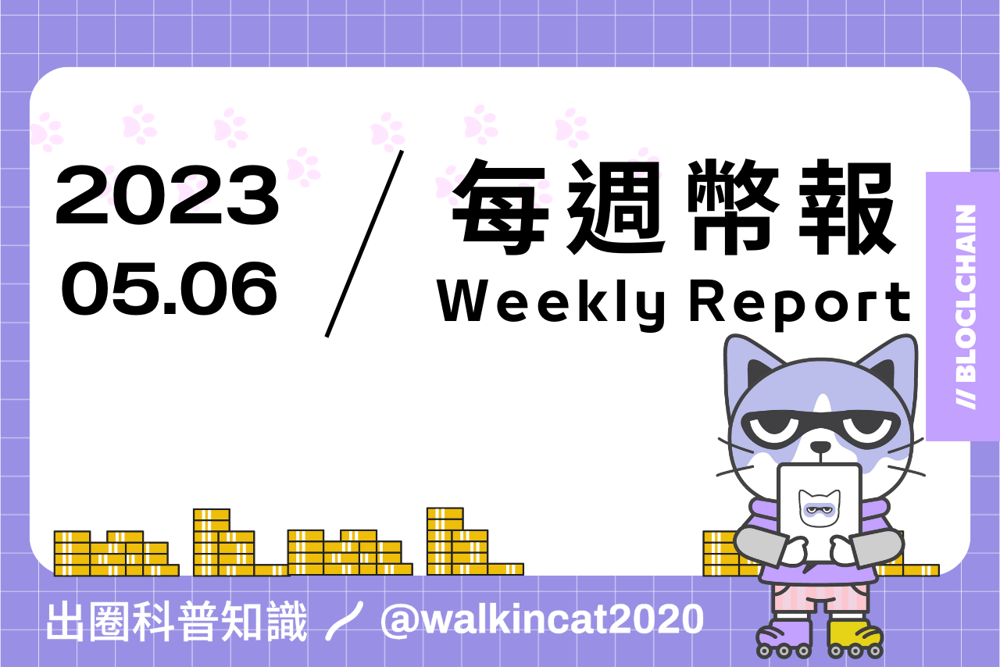
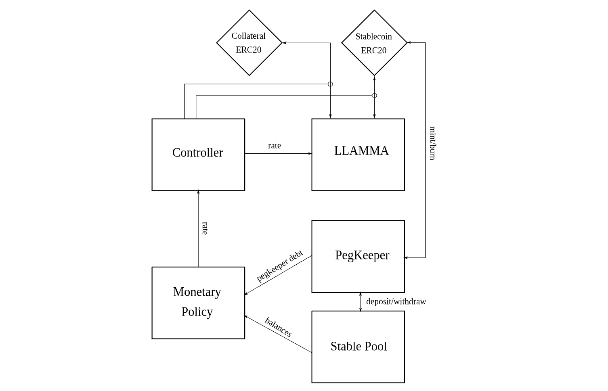
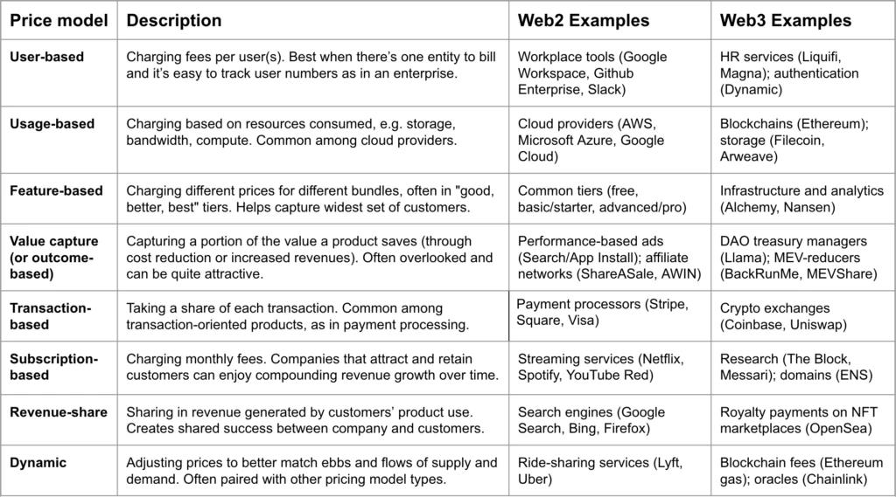
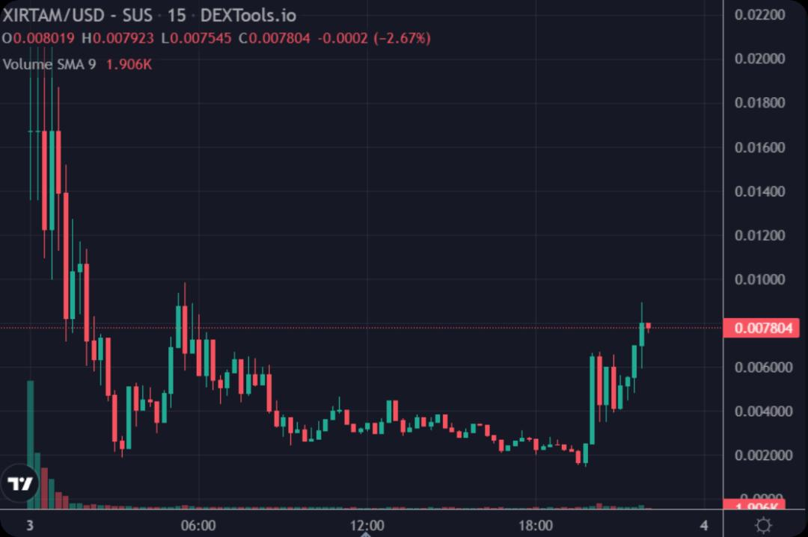

## 專案分析

- 深度解析 Blur 的新借貸協議 Blend
- 一文解讀 Sui & Aptos 上的集中流動性協議 Cetus
- 淺析最新推出的 Curve 原生穩定幣 crvUSD

## 觀點剖析

- 關於 Ordinals、區塊空間及 BRC-20 未被深思的問題
- 8 位 Crypto KOL 眼中的 2023 年後敘事趨勢
- a16z：Web3 創業中定價策略的 6 個關鍵問題
- 總結 Consensus 2023 共識大會上的亮點及趨勢

## 市場分析

- 淺談跨鏈橋的 6 大發展趨勢與演變方向
- 忠誠度革命：從實物到積分再到 NFT，行為經濟學在 Web3 中的演繹

## 熱門事件

- 韭菜收割指南：XIRTAM 從開盤到跑路的一夜

---

- 內文
    
    ## 深度解析 Blur 的新借貸協議 Blend
    
    Blur 最近與 Paradigm 合作推出了 Blend，一個點對點的 NFT 永續借貸協議，並且提供貸款購買NFT的功能。 Blend 的特點主要是點對點、永續借貸、無到期日、無預言機等，並且藉由統一借貸的非必要要素來減少系統複雜度，實現借貸關係在系統內部的靈活轉移，由市場博弈來定價風險和收益。 
    
    Blend 將貸款方退出和清算合而為一，並在借貸的期限要素上使用永續 + 隨時還款的設置，改善貸款方的流動性問題。在 Blend 上借款買 NFT 和貸款購買房子類似，透過買 NFT 的同時發起抵押貸款來達到只要付頭期款就能拿到商品的場景，提升了資金效率。Blur 這次推出的新 NFT 借貸協議將能夠為用戶帶來更好的用戶體驗，也會是攪動 NFTFi 市場的一個關鍵角色。
    
    [https://capitalismlab.substack.com/p/blur-blend](https://capitalismlab.substack.com/p/blur-blend)
    
    
    
    ## 一文解讀 Sui & Aptos 上的集中流動性協議 Cetus
    
    Cetus 是基於 Move 生態的 Dex 和流動性協議，它使用類似於 Uniswap V3 的算法構建集中流動性協議來提升用戶的交易體驗，並且 LP 除了可以賺取更多手續費外，在資金使用上的效率也跟著提高。另外，Cetus 還包含無許可建池、自定義交易手續費等級、倉位自動管理和可組合性等特性。
    
    Cetus 採用 xToken 的經濟模型，用戶可透過持有 xCETUS 和 CETUS token 來獲得協議收益的分成。未來，集中流動性協議可能會帶來更多 DeFi 的創新，如 LP 自動化流動性管理協議、新型機槍池和槓桿挖礦、新型衍生品體系等。Cetus 團隊具有豐富的集中流動性做市算法開發經驗，期待 Cetus 能夠成為 SUI 生態中的 Uniswap。
    
    [https://panewslab.com/zh/articledetails/hef9dl3f.html](https://panewslab.com/zh/articledetails/hef9dl3f.html)
    
    
    
    ## 淺析最新推出的 Curve 原生穩定幣 crvUSD
    
    去年 11 月 Curve 開發團隊就已推出其原生穩定的 crvUSD 的代碼及白皮書，而 crvUSD 也在近日被部署在以太坊主網，根據 crvUSD 白皮書的內容，crvUSD 具有和穩定幣 DAI 相似的功能，能夠進行超額抵押，並透過 CDP（抵押債務頭寸）機制來讓用戶鑄造穩定幣，而 crvUSD 也採用創新的借貸清算算法（LLAMMA），透過不斷的清算與去清算的過程來減少清算所帶來的影響。未來 Curve 能否藉由 crvUSD 為 DeFi 領域帶來新的格局，並且成功撼動整個去中心化穩定幣市場，後續可以拭目以待。
    
    [https://www.panewslab.com/zh/articledetails/92e0zjqz.html](https://www.panewslab.com/zh/articledetails/92e0zjqz.html)
    
    
    
    ## 關於 Ordinals、區塊空間及 BRC-20 未被深思的問題
    
    這篇推文討論了關於使用區塊鏈空間來創建 Ordinals NFT (非同值化代幣) 和 FT (同值化代幣) 的爭議，以及是否需要在鏈上寫入數據來實現這一目標作為主要探討。Ordinals NFT 分為兩個部分，一個是 Ordinals 理論，另一個為 Inscription（銘文），雖然使用區塊空間來將數據寫入可以推動對它的需求，並為礦工帶來更高的收入，但作者認為這個動作是非必要的，透過鏈下銘文也可以保障交易的安全性，並且在定義上可以更加靈活。
    
    因為比特幣能夠實現抗重複花費機制以及定義狀態，因此可以讓數據直接與 UTXO 連結即可，而這也是簡化版的 RGB 協議概念。作者也提到過往的 Omni 協議也和 BRC-20 一樣，都是直接將裸數據寫入鏈上，最後也證明直接使用比特幣區塊鏈是非常沒有效率的，因此 BRC-20 能否持續在市場上發酵仍有待觀察。
    
    [https://twitter.com/AurtrianAjian/status/1651775818727821313](https://twitter.com/AurtrianAjian/status/1651775818727821313)
    
    
    
    ## 8 位 Crypto KOL 眼中的 2023 年後敘事趨勢
    
    文章中藉由訪問 8 位在推特上具有影響力的加密 KOL 來了解他們對於2023 年 Web3 趨勢的看法，多數的 KOL 認為 LSD、L2（zk-Rollup）、RWA 會是推動 2023 年加密世界趨勢的重點，另外對於 DeFi 的前景，Crypto Ita、The DeFi Investor 和 Louround 認為接下來將出現更多 DeFi 的殺手級應用，並被大規模地採用，並持樂觀的態度看待 DeFi 市場的發展；不過 DeFI Saint 則認為當前的 DeFi 還未能夠被大規模採用，鏈上的安全性相比 CeFi 仍顯不足。接下來不管 Web3 會被哪個賽道所帶領，都將會讓整個加密領域繼續向前邁進。
    
    [https://www.odaily.news/post/5186802](https://www.odaily.news/post/5186802)
    
    
    
    ## a16z：Web3 創業中定價策略的 6 個關鍵問題
    
    本文主要在討論 Web3 創業者在為新產品或服務定價時，需要考慮哪些因素，並且文中也提出常見的定價基本原則與模型可供依循。通常要為產品定價時須考量到市場環境和產品特性，並根據客戶需求和市場狀況混合使用不同的定價方法。
    
    另外也能透過回答關鍵的六個問題來尋找最佳的定價策略，首先是了解各個基於不同面向的定價方法，並依據產品特性選擇適合自己的定價策略。其次是考慮是否有機會在產品線中實現價格差異化，透過 “Good、Better、Best” 原則為不同的客戶群體量身定制產品。此外，確保產品的功能和特性與定價的理念相一致，並在早期客戶期望值確定後就儘量避免改變價格。創業者若能掌握這些定價原則，相信在進入市場時能夠更好的找到產品的價值定位。
    
    [https://panewslab.com/zh/articledetails/jhlebqan.html](https://panewslab.com/zh/articledetails/jhlebqan.html)
    
    
    
    ## 總結 Consensus 2023 共識大會上的亮點及趨勢
    
    文中主要介紹了 2023 年 Consensus 共識大會的精彩觀點和趨勢。大會中談論了關於監管、RWA、穩定幣、DeFi、CeFi、NFT和元宇宙等熱門話題。在監管方面，美國前 CFTC 主席和 coinbase 及 Grayscale CEO 等人重點討論了關於未來監管的明確性和 CBDC 的發展；關於 NFT 領域的討論，Art Blocks 聯合創始人表示，NFT 版稅對創作者和 NFT 生態系統都很有價值，對於創作者來說更是具有吸引力，並且能讓他們撇除謀生壓力而能夠創造出更好的作品；最後在 DeFi 和 CeFi 的探討中，Uniswap Labs 政策負責人認為 CeFi 可以更好的結合當前金融監管環境，但未來 DeFi 仍會成為金融系統最主要基礎設施，不過 CeFi 並不會消失，而是在金融系統中扮演更好的過渡角色。
    
    [https://www.panewslab.com/zh/articledetails/jyn7i5jp.html](https://www.panewslab.com/zh/articledetails/jyn7i5jp.html)
    
    
    
    ## 淺談跨鏈橋的 6 大發展趨勢與演變方向
    
    本文討論了當前跨鏈互操作性的趨勢，作者提到這些互操作性主要是通過橋來實現，大部份的橋分為三類，分別為外部驗證人、輕客戶端和流動性網絡+原子交換這三種，而目前市場上多數仍選擇外部驗證人作為其驗證機制，雖然已有多簽、MPC、TSS 等技術，不過外部驗證人技術的橋依舊是黑客攻擊事件的主要目標。
    
    市場對於互操作性技術有幾個新的探索方向，包括 zk 技術、基於樂觀假設的橋、流動性共享層協議、Shared Sequencer、使用 DA 層 + Rollup 的擴展數據實現 Trustless 跨鏈，以及透由密碼學在其他鏈上操作。目前的跨鏈橋最為人詬病的就是安全性問題，不管上述的互操作性發展方向會由誰取代當前的主流技術，可以知道的是，資產安全性會是首要必須被解決的當務之急。
    
    [https://panewslab.com/zh/articledetails/slca83cs.html](https://panewslab.com/zh/articledetails/slca83cs.html)
    
    
    
    ## 忠誠度革命：從實物到積分再到 NFT，行為經濟學在 Web3 中的演繹
    
    目前多數品牌現有的忠誠度計劃大多運作於封閉系統中，消費者賺取的獎勵通常有限制，不能流通轉移，也無法貨幣化和出售，不過隨著區塊鏈技術的發展，忠誠度代幣化將變得可行。品牌可藉由透過增加忠誠度計劃的價值來受益，像是可以聯合其他商家打造可互操作的忠誠度計劃，讓消費者能在多個商家中使用積分，隨著忠誠度代幣的應用場景增加，消費者的感知價值也會增加。
    
    忠誠度代幣化需要考慮三個部分，包括要選用 Token 還是 NFT，如何促進客戶與品牌的黏著度，以及如何驅動客戶持續消費獲取積分等問題，另外也需要思考在跨品牌間的供需動態機制及客戶數據安全的情況。不過，隨著區塊鏈技術的進步，忠誠度代幣化將能夠完整的為小型品牌和消費者解鎖新的機會，讓它們之間共享更多的價值。
    
    [https://panewslab.com/zh/articledetails/7l9369u2eaqk.html](https://panewslab.com/zh/articledetails/7l9369u2eaqk.html)
    
    
    
    ## ****韭菜收割指南：XIRTAM 從開盤到跑路的一夜****
    
    在2023年5月3日，加密貨幣市場上的一種名為XIRTAM的代幣暴跌90%，在短短幾小時內幣價從0.02美元跌至0.0018美元。
    
    XIRTAM項目定位為一個免費的Play-to-Earn遊戲世界，玩家無需購買入場券即可參與。然而項目方的審計、KYC等問題讓人質疑其真實性，最終該項目被證實為一個由中國團隊包裝成外國項目的殺豬盤。此外一些知名的KOL和大V在此類項目中也扮演了推波助瀾的角色，他們通過收取好處為項目站台，但在項目出現問題時紛紛表示懊悔。
    
    為了避免在類似事件中遭受損失，投資者需要保持謹慎，進行自主判斷和研究，同時監管機構也應認真對具有影響力的KOL進行管理，以維護市場秩序。
    
    在幣圈你能夠相信的只有你自己，投資前務必進行充分的研究和判斷，避免盲目跟風而陷入陷阱。
    
    [https://followin.io/zh-Hans/feed/4224520](https://followin.io/zh-Hans/feed/4224520)
    
    

# 結尾

感謝您閱讀本篇文章，希望本文的內容能夠對您有所啟發和幫助。

如果您對區塊鏈出圈科普知識感興趣，請搜索 🔍 WalkinCat 走路貓，了解更多相關資訊。如果您想繼續關注我們的最新文章，歡迎訂閱我們的電子報，或透過以下連結找到我們。我們期待您的想法和反饋，謝謝您的支持！

- [訂閱走路貓](https://portaly.cc/walkincat)