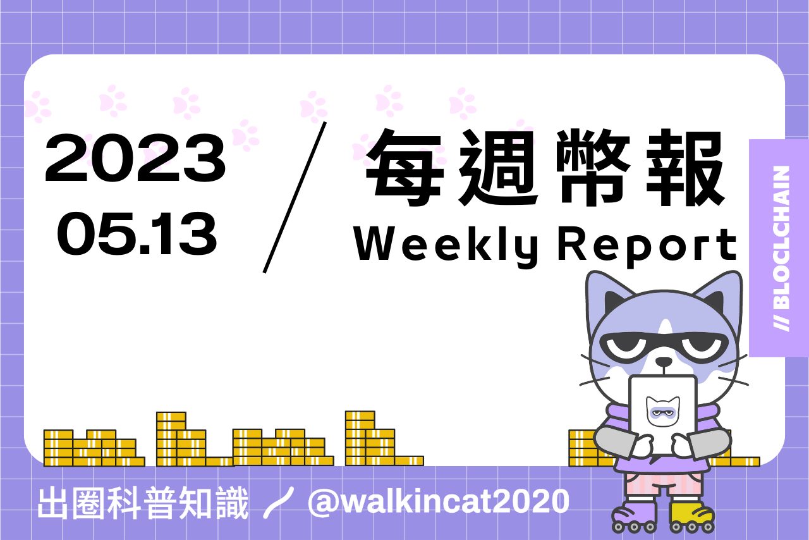
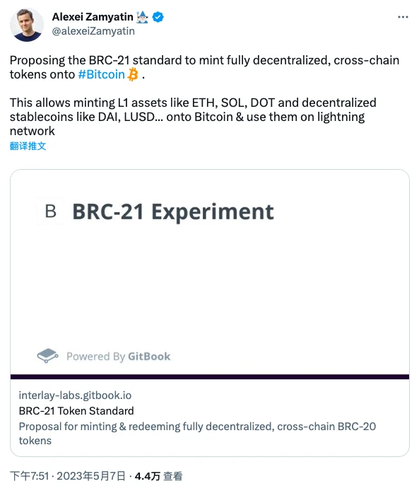
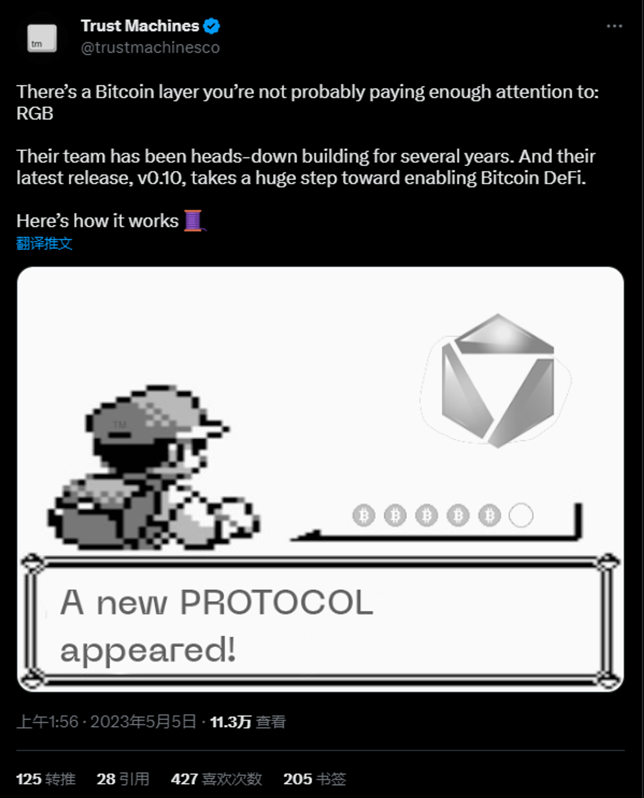
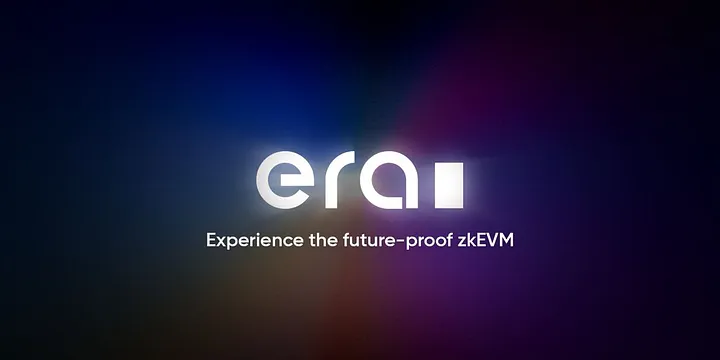
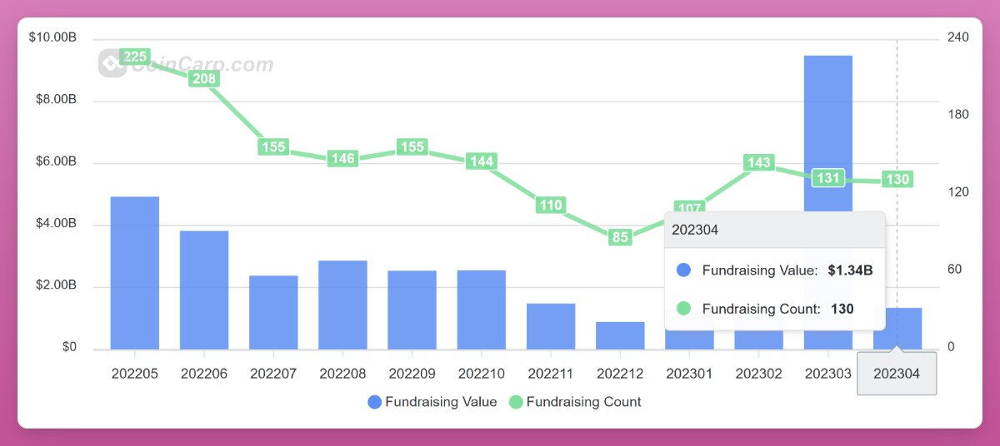

## 專案分析

- BRC-20、ORC-20 之後，BRC-21 又是什麼？
- 一覽比特幣的 RGB 協議：開啟資產發行新場景
- 帶你快速了解主權 Rollup 的運作原理

## 觀點剖析

- PEPE 早期投資者經驗分享：發掘 MEME 的策略、工具及時機
- 比特幣上的 MEME 熱潮，能否借此開啟閃電網路的第二春？
- 從 UGC 到 UGP 的過渡，Web 3 的消費者品牌與共創
- Foresight Ventures：DEX 範式的改變與發展

## 市場分析

- 是什麼讓 zksync 與眾不同？ 關鍵區別在於使用狀態差異
- 風投機構也看好的 5 個創新 DeFi 應用

## 熱門事件

- 馬斯克轉推的 Milady 是什麼？帶你一探它的現狀和未來

---

- 內文
    
    ## BRC-20、ORC-20 之後，BRC-21 又是什麼？
    
    跨鏈互操作性專案 Interlay 創始人Alexei Zamyatin 提出了 BRC-21 標準，該標準旨在向比特幣網路引入完全去中心化的跨鏈資產。 BRC-21 與 BRC-20 不同的地方在於 BRC-21 不是憑空生成，而是需要透過鎖定起始鏈上的資產來生成，也就是可以在比特幣網路上鑄造 BRC-20 版本的其他鏈上資產。

    BRC-21 和 BRC-20 在部署的方式上大同小異，但是 BRC-21 多添加了新字段 src 及 id，分別來指定起始鏈及起始鏈上的目標代幣，而原本定義鑄造限制的「lim」的字段則被刪去。不過 Alexei Zamyatin 認為這個協議最大的用意在於能夠引入去中心化穩定幣，並將其部署到閃電網路或其他支付協議上，透過這個標準，未來就可以簡單並且以完全去中心化的形式來橋接資產到比特幣網路上。
    
    [https://www.odaily.news/post/5186935](https://www.odaily.news/post/5186935)
    
    
    
    ## **一覽比特幣的 RGB 協議：開啟資產發行新場景**
    
    近期比特幣上的資產發行成為加密世界的熱門話題，除了前陣子刮起熱潮的 Ordinals 和 BRC-20之外，另一個沉寂已久的協議 —— RGB 也再次成為了大家關注的焦點。 
    
    RGB 協議最初可追溯到 2018年，該協議將資產發行、所有權和狀態更新與比特幣的 UTXO 模型結合在一起。透過綁定資產狀態與 UTXO 模型實現了在比特幣網絡上進行資產發行、轉移和驗證的功能，同時保有隱私性、可擴展性和去中心化的特點，也能很好地和閃電網路結合。或許在這次的 BRC20 的投機浪潮下，反而能夠加速推進比特幣生態的發展，並讓大家重新看見 RGB 協議帶來的新視野。
    
    [https://panewslab.com/zh/articledetails/1bnuu827.html](https://panewslab.com/zh/articledetails/1bnuu827.html)
    
    
    
    ## 帶你快速了解主權 Rollup 的運作原理
    
    Sovereign Rollups 是一種新型的區塊鏈擴容解決方案，通常 Rollups 主要會執行以下三個功能：進行可驗證計算、確保交易數據可用性和分叉選擇規則。一般 SC Rollups （Smart Contract Rollups）的完整性證明只包括計算的有效性，在數據可用性規則和分叉選擇規則則是在智能合約上定義，因此若要進行任何更改就必須更新整個智能合約，而更新的方式又可能在安全性及中心化方面有一定的疑慮。
    
    Sovereign Rollups 的完整性證明則包含分叉選擇規則、DA 規則和執行的有效性，因此 Sovereign Rollups 的節點可以自行管理這個 Rollup。不過 Sovereign Rollups 因為與數據可用性層沒有去信任的橋接，因此在鏈的分叉問題上仍尚待解決，不過主權 Rollups 也為模組化設計提供一個新的概念。
    
    [https://twitter.com/doganeth_en/status/1655080845642702848](https://twitter.com/doganeth_en/status/1655080845642702848)
    
    
    
    ## PEPE 早期投資者經驗分享：發掘 MEME 的策略、工具及時機
    
    迷因幣 PEPE 在短時間內的瘋漲，帶動許多幣圈玩家開始尋找下一個能夠賺到豐厚回報的迷因幣。作者提出玩家欲投資迷因幣時需要注意以下 5 個重點：監控正在上漲的代幣、驗證代幣的社區文化、研究代幣基本面、投資 “開創者” 或仿盤，以及跟著聰明錢操作。
    
    當在市場上選定代幣並準備買入後，需要按照這些心態與計畫來交易，包括將此次交易視為賭局，並且使用專屬的錢包來交易迷因幣，以及善用技術分析。若盈利時需及時獲利了結，可在翻倍後取出本金，再用利潤進行交易，並在價格頂部出現之前，繼續採用這個策略。不過若觀察到代幣的 24 小時交易量下降、持有人數量減少、鯨魚出售等關鍵指標，代表頂部有可能已出現，就須考慮全數獲利了結，只要能透過這些方式，不僅有助於增加迷因幣交易盈利的概率，也能降低相對應的風險。
    
    [https://www.panewslab.com/zh/articledetails/gyla3lyv.html](https://www.panewslab.com/zh/articledetails/gyla3lyv.html)
    
    
    
    ## 比特幣上的 MEME 熱潮，能否借此開啟閃電網路的第二春？
    
    最近的 MEME 熱潮導致比特幣網路擁擠，並且因長時間沒有出塊而引起社群恐慌，也因為比特幣的性能問題讓閃電網路再次成為比特幣生態中討論的重點。作者針對閃電網路進行基本的運作概念解釋，閃電網路是比特幣的二層交易擴容方案，與以太坊的 Layer 2 有很大區別，它主要是透過在節點間建立通道，在通道內進行交易並採用鏈下結算，只有在開啟和關閉通道時才會把交易結果上鏈，藉由這樣的機制來達到交易速度的提升。
    
    雖然閃電網路因為門檻與生態問題導致其發展進程較緩慢，但作為比特幣最主流的擴容方案，大家對它的接受度已經開始不斷的增加，也引起許多創業者和投資人的關注，閃電網路在當前的時空背景下是十分具有發展潛力與前景。
    
    [https://twitter.com/jason_chen998/status/1655611440437555200](https://twitter.com/jason_chen998/status/1655611440437555200)
    
    
    
    ## 從 UGC 到 UGP 的過渡，Web 3 的消費者品牌與共創
    
    文章中主要介紹共創對消費者品牌的影響，並探討共創如何改變品牌和消費者之間的關係。品牌可以透過社群媒體讓消費者一起參與共創過程，並分享對產品的反饋、想法和建議。文中也提到共同創作可以實現創作者階級民主化，藉由讓消費者變為創作者參與產品開發，除了可以共同塑造品牌文化，品牌也可以建立更強大的客戶關係。
    
    品牌透過 Web3 技術可以提供更好的社群協調和改善歸屬機制來實現共同創作，也可以幫助消費者和品牌之間建立更好的信任關係，並為消費者提供更多的權力和控制權。隨著共創產品的持續增長，未來品牌建構者可以透過 NFT 與 FT 的形式來和他們的社群達成財務一致性，並為鏈上共創帶多優秀的產品與生態。
    
    [https://multicoin.capital/2023/05/11/from-ugc-to-ugp-consumer-brands-and-co-creation/](https://multicoin.capital/2023/05/11/from-ugc-to-ugp-consumer-brands-and-co-creation/)
    
    
    
    ## Foresight Ventures：DEX 範式的改變與發展
    
    文中對於 Dex 的發展歷程以及可能的發展方向進行探討，並針對三大方向展開更細部的討論，包括在現貨交易聚合器上的 AMM 與 RFQ 模式對比，veToken 模式在 Boosted pools 與 Core pools 引入後的收益結構改變，以及重塑 Liquidity Position 型態的 Uni V3。
    
    除了上述用宏觀角度去展開關於 Dex 的變遷和發展性外，還有許多在 Dex 上的創新功能出現，當大家認為 DeFi 的發展已經差不多的時候，市場卻總是還在不斷的創新與探索新的商業模式，不過怎樣的創新能夠成為長久的標準或是只是一時的噱頭，只能靜待市場及時間給出證明。
    
    [https://medium.com/@foresightventures-zh/dex-范式的变迁与发展-1e29b06298fa](https://medium.com/@foresightventures-zh/dex-%E8%8C%83%E5%BC%8F%E7%9A%84%E5%8F%98%E8%BF%81%E4%B8%8E%E5%8F%91%E5%B1%95-1e29b06298fa)
    
    
    
    ## 是什麼讓 zksync 與眾不同？ 關鍵區別在於使用狀態差異
    
    zksync 透過只在 L1 上面發布所有存儲插槽變更後的狀態差異來達到對許多方面的改善，例如支付方面，重複支付及高頻支付的狀況下，可以更便宜並更高效的改善費用的支出，對於在 Oracle 及高頻交易的應用可以更加優化。DeFi 方面像是 Balancer 這種帶有指數特徵，必須一直 re-balancing 的產品也會變得更有效率並且更便宜。最後在隱私方面，透過狀態差異可以實現更實惠的隱私保護，也讓用戶在 L2 上可以擁有更大規模的交易及匿名可信度。zksync 目前的生態應用也在漸漸發展，或許可以憑藉著這部分的優勢，在現有的應用上有所突破。
    
    [https://twitter.com/0xsebastiena/status/1655160790905769984](https://twitter.com/0xsebastiena/status/1655160790905769984)
    
   
    
    ## 風投機構也看好的 5 個創新 DeFi 應用
    
    加密分析師 Ignas 透過分析近期的市場融資狀況，發現在 DeFi 領域的募資金額有明顯的上升趨勢，他針對主要關注的風投機構投資的種子輪專案上，提出上個月心目中認為前五名的 DeFi 專案：
    
    1. CatalystAMM：跨鏈流動性層協議，可以連接不同鏈上的流動性，帶有模組化與多鏈的敘事。
    2. SwaapFinance：解決永久損失（IL）的問題，並透過動態差價和價格預言機來降低交易成本。 
    3. Fare Protocol：利用概率智能合約來提供不同於以往的代幣動力學。 
    4. Pear Protocol：簡化交易對的敘事性交易平台，可在一筆交易中執行做多一個代幣，並以槓桿方式放空另一個代幣。 
    5. Playbux：擁有雙重協議的元宇宙平台，包含可以用 $BRK 來購買及遊玩 “夾娃娃” 的遊戲，以及可以線上購物獲取 BUSD 回饋的 “購物返現” 平台。
    
    未來可以繼續關注上述這幾個項目的發展，相信這些特殊且創新的應用可以帶領 DeFi 進入更有趣的發展敘事。
    
    [https://twitter.com/DefiIgnas/status/1656188333335388160](https://twitter.com/DefiIgnas/status/1656188333335388160)
    
    
    
    ## 馬斯克轉推的 Milady 是什麼？帶你一探它的現狀和未來
    
    Milady 是 2021 年由 Remilia 組織發起的一個 NFT 項目，不過因創始人過往曾被指稱涉及青少年自殺、厭食和性誘導，雖然它聲稱這些言論只是惡搞，不過也造成當時的 NFT 價格暴跌 50%，但是社區對於 Milady 依然具有強烈的認可。Milady 這種敢於反抗的獨特藝術成為了反文化的圖騰和象徵。Milady 重現了千禧年的日本原宿時尚，用時裝視覺佔比、統一度和審美（Drip score）來代表它的稀缺性。作者認為 Milady 在金融與生成藝術的结合上，以及如何創造 rarity，或是在平衡算法的機制上都非常出色，也是一個內涵十分豐富的 NFT，目前市場上還沒有任何的 NFT 可以代表它所承載的意義。
    
    [https://twitter.com/codeboymadif/status/1656407992500367360](https://twitter.com/codeboymadif/status/1656407992500367360)
    
    

## 結尾

感謝您閱讀本篇文章，希望本文的內容能夠對您有所啟發和幫助。

如果您對區塊鏈出圈科普知識感興趣，請搜索 🔍 WalkinCat 走路貓，了解更多相關資訊。如果您想繼續關注我們的最新文章，歡迎訂閱我們的電子報，或透過以下連結找到我們。我們期待您的想法和反饋，謝謝您的支持！

> [歡迎訂閱走路貓](https://portaly.cc/walkincat)