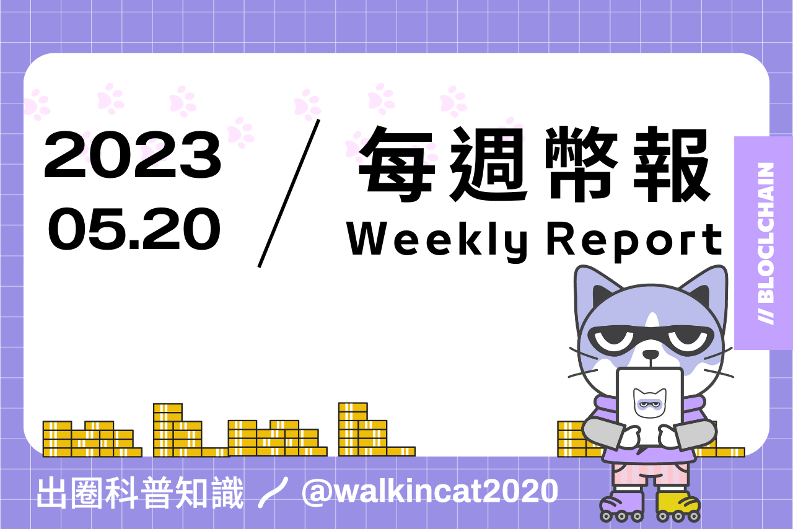

## 專案分析

- ERC-6551：NFT 遊戲規則改變者
- EIP-6969 的 CSR 協議如何再次改變以太坊的經濟模型

## 觀點剖析

- 8 個加密貨幣投資者必讀的紀律計劃建立指南
- 比特幣 DeFi：突破還是泡沫？
- LTC 減半 70 天倒計時：市場的冷漠與未來前景分析
- MEME 幣：從 “梗” 到市值破億，背後的力量是什麼？

## 市場分析

- 對比及分析 5 大模塊化區塊鏈的架構、擴展解決方案、機制和互操作性
- DeFi 三大件：DEX、借貸、穩定幣方面的新趨勢
- 閃電網路，擁堵的 BRC-20 正在尋找的出路

## 熱門事件

- 引發 Crypto 世界關注的 Worldcoin 究竟是何方神聖？

    
## ERC-6551：NFT 遊戲規則改變者
    
本文主要針對新的代幣標準 ERC-6551 進行基本介紹，並探討這個協議可能為 NFT 帶來的潛在應用與想像。ERC-6551 透過代幣綁定帳戶（TBA）的概念讓 NFT 可以同時作為智能合約帳戶，使其擁有完整的帳戶功能，像是能讓 NFT 儲存其他 NFT 及 ERC20 的代幣，也能夠直接與 Web3 的應用程式進行交互。
    
ERC-6551 除了對 NFT 應用的靈活性能夠顯著的提升，在 Web3 遊戲中更是打開了新的想像空間，不過 ERC-6551 在安全上也有一些問題需要留意，例如潛在的欺詐行為和發生所有權循環的情況。隨著區塊鏈技術的成熟與多樣，未來肯定會有更多有趣的應用來持續推動 NFT 領域的發展與創新。
    
[https://www.techflowpost.com/article/detail_11910.html](https://www.techflowpost.com/article/detail_11910.html)
    

    
## EIP-6969 的 CSR 協議如何再次改變以太坊的經濟模型
    
文中所介紹的 EIP6969 協議是基於 EIP1559 協議的修改版本，EIP1559 是將每一筆的 Gas 費分為基本網路費用和給礦工的小費，除了基本網路費用會被燃燒掉來達到通縮價值外，還能調節原本難以預估的 Gas 費用。而 EIP6969 提出了一種新的 Gas 費分配機制，它允許一部分的 Gas 費分配給與之進行交互的合約開發者，這個協議也被稱為合約安全收入（Contract Secured Revenue, CSR），EIP6969 核心主張是希望能將以太坊的收入更合理的分配給貢獻者。雖然 EIP6969 現在還處於早期論證的階段，不過它所提出的概念若被正式採用，將會大幅改變當前的經濟模型，是值得市場保持關注的新提案。
    
[https://twitter.com/jason_chen998/status/1657796483608104960](https://twitter.com/jason_chen998/status/1657796483608104960)

## 8 個加密貨幣投資者必讀的紀律計劃建立指南
    
文中介紹了如何正確的建立和遵守在加密貨幣的紀律計劃，在心態方面必須先擁有紀律的態度，並設立明確的目標，在達成目標前要避免心態受到其他因素干擾，心態面調整完成後最重要的關鍵就是制定在加密貨幣市場的投資紀律，作者提供了以下幾點方向：
    
1. 採用定期定額投資（DCA），並且不受市場外部因素干擾影響。
2. 分配投資組合，並且適時的再平衡以維持訂定好的百分比組成。
3. 訂定獲利了結的計畫並嚴格遵守。
4. 分析協議並選擇適合的投資標的，而非盲目 FOMO 跟風。
5. 管理並篩選有用的資訊來源，以進行更有效率的投資決策。
6. 記錄投資過程，定期檢查以改進投資策略。
7. 專注完成金字塔底端的小目標，從而獲得動力去向長遠目標前進。
8. 讓交易策略、知識途徑及投資計畫盡可能的簡化。
    
在金融市場和加密貨幣中，建立紀律對於實現成功十分重要，紀律是一種長期的生活方式，相信只要能好好遵守，你也能在加密貨幣的世界中脫穎而出。
    
[https://twitter.com/iamzeroika/status/1657044242093719552](https://twitter.com/iamzeroika/status/1657044242093719552)
    

    
## ****比特幣 DeFi：突破還是泡沫？****
    
Taproot 升級使比特幣有機會可以開始進入去中心化金融領域，在此之前比特幣持有者需要將其轉換成以太坊的 wBTC 來進行 DeFi。但現在他們可以直接使用比特幣參與 DeFi 活動，這對於比特幣來說是一大步，除了增加了比特幣的效用之外，也可以吸引更多用戶。

然而比特幣的 DeFi 領域正在發展當中，它是否能取代以太坊成為首選的 DApp 部署平台還有待觀察，不過若比特幣的 DeFi 真正繁榮起來，龐大的比特幣經濟量體將能夠讓 DeFi 的金融發展更上一個層次。
    
[https://followin.io/zh-Hans/feed/4526023](https://followin.io/zh-Hans/feed/4526023)
    

    
## ****LTC 減半 70 天倒計時：市場的冷漠與未來前景分析****
    
LTC 即將迎來減半事件，研究員 Alex 深入探討了其背後的心理學和市場反應。萊特幣每 4 年就會將區塊獎勵減半一次，以限制通貨膨脹並增加其稀缺性，儘管過去比特幣的減半事件多次引發了價格的拋物線上升，但萊特幣並不一定會有同等現象。

通常減半事件會降低礦工獎勵，進而降低供應壓力和價格，但也可能削弱網路的安全性，不過如果大家會因減半事件而對萊特幣投下信任票，這就體現出大家對網路安全性的價值認知。然而，近期市場對山寨幣的狂熱已不像以往，這可能讓萊特幣的減半敘事受到挑戰，如果萊特幣不能在接下來的 100 天內找到支持，那可能也象徵著其他減半敘事代幣的影響力將逐漸衰退。
    
[https://www.techflowpost.com/article/detail_11894.html](https://www.techflowpost.com/article/detail_11894.html)
    

    
## ****MEME 幣：從 “梗” 到市值破億，背後的力量是什麼？****
    
MEME 幣通常源自於網路流行文化，現已成為一種新型態的加密資產。最初的 MEME 幣旨在創建一種有趣的數字貨幣，並利用網路文化元素來吸引更多參與者。透過公平的分發模式和獎勵機制，MEME 幣藉此增強了社區的活躍度和代幣流通性，低廉的價格和高收益預期吸引了許多初次嘗試投資加密資產的人，使其成為一種具有投機價值的資產，強大的敘事性也為 MEME 幣提供了快速傳播和走紅的可能性。儘管目前 MEME 幣還存在許多不完善之處，但其持續的創新與可能性表明在未來，MEME 幣可能成為一個融合技術、文化和經濟等多種元素的開放數字經濟。
    
[https://web3caff.com/zh/archives/60967](https://web3caff.com/zh/archives/60967)
    

    
## 對比及分析 5 大模塊化區塊鏈的架構、擴展解決方案、機制和互操作性
    
本文中針對 Polygon、Avalanche、Polkadot、Cosmos 和 Besu 這五種模塊化的區塊鏈進行各方面的對比，從最基本的共識機制、驗證方式、交易吞吐量，再到可開發性、安全性、儲存、帳戶抽象等都詳細地列出各自的特性與功能，透過在不同機制及模式上的比較可以快速了解這些模塊化區塊鏈的差異與相似之處。

而其中比較少進入大眾視野的區塊鏈 Besu 其主要是針對公共和私有權限網路而設計，適合企業級別的應用。不過不管這些模塊化區塊鏈有哪些特點，應用如何透過這些特點來最大化的發揮其優勢，才是在選擇採用哪個區塊鏈時最重要的關鍵。
    
[https://twitter.com/CryptoNasss/status/1657037245931569152](https://twitter.com/CryptoNasss/status/1657037245931569152)
    

    
## DeFi 三大件：DEX、借貸、穩定幣方面的新趨勢
    
本文介紹了 DeFi 領域中 DEX、借貸和穩定幣三大面向的發展趨勢。在 DEX 方面包含縫合多種應用模式的 Ve（3,3）、目前有兩種組合模式的 Hybrid DEX、UniV3 License 到期後的各種 UniV3-Fi 應用，以及 Curve 在 Tricrypto New Generation 升級後與 Uniswap 的對決。

在借貸方面主要是全鏈借貸、建立抵押資產隔離池和無預言機無清算的借貸方式為主要的市場方向。最後，在穩定幣方面則有增加去中心化和多樣化生態系統的 MakerDAO Endgame 計畫、基於 RWA 的穩定幣，或是可能基於 LSDFi 之上的穩定幣。透過文章可以了解到構成 DeFi 最基本也最重要的三大要素發展方向，可以多關注並深入了解這些面向內的應用，在下一次的 DeFi Summer 來臨時就能好好把握住。
    
[https://www.techflowpost.com/article/detail_11915.html](https://www.techflowpost.com/article/detail_11915.html)
    

    
## **閃電網路，擁堵的 BRC-20 正在尋找的出路**
    
近日由於 BRC-20 的持續熱度，比特幣網路擁塞現象加劇，進而引發了人們對於如何解決這一問題的討論，專注於解決比特幣堵塞問題的閃電網路因此再次受到關注。閃電網路是一種建立在比特幣網路上的第二層支付協議，旨在解決比特幣網路的擁塞問題，這種協議利用了中本聰提出的支付通道概念，允許兩方創建點對點的支付通道，在該通道中，雙方可以無限次地進行即時且價格低廉的交易，通道中的所有交易都不需要獲得所有節點的批准，從而大大提高了交易速度。為了緩解提款擁堵現象，幣安也開始啟用比特幣閃電網路來支持提款，市場在經歷這樣的網路擁堵狀況後，或許會讓更多的目光願意投注在閃電網路的發展上。
    
[https://mp.weixin.qq.com/s/V3zLbGOFPn32vEZSxubWYA](https://mp.weixin.qq.com/s/V3zLbGOFPn32vEZSxubWYA)
    

    
## 引發 Crypto 世界關注的 Worldcoin 究竟是何方神聖？
    
Worldcoin 是一個創新的區塊鏈專案，由 Y Combinator 前任總裁，現為 OpenAI 的創始人 Sam Altman 帶領，目標是向全球每個人免費空投代幣，以創造一個全民基礎收入（UBI）的去中心化系統。

總量為 1000 億，20 億給 Worldcoin 基金會和投資者，其餘 80 億在全球社區分發。透過 World App 的 "World ID" 功能，用戶可以實現一人一碼的方案。利用虹膜掃描來實現身份驗證，成功驗證的用戶每月都會獲得 Worldcoin 空投。雖然這種方法引起了隱私問題的爭議，但 Worldcoin 使用零知識證明的技術來保護用戶隱私。Worldcoin 的目標是打造一個數字烏托邦，但同時也將謹慎考慮合規性問題。
    
[https://twitter.com/followin_hans/status/1659174703129567233](https://twitter.com/followin_hans/status/1659174703129567233)
    

## 結尾

感謝您閱讀本篇文章，希望本文的內容能夠對您有所啟發和幫助。

如果您對區塊鏈出圈科普知識感興趣，請搜索 🔍 WalkinCat 走路貓，了解更多相關資訊。如果您想繼續關注我們的最新文章，歡迎訂閱我們的電子報，或透過以下連結找到我們。我們期待您的想法和反饋，謝謝您的支持！

> [歡迎訂閱走路貓](https://portaly.cc/walkincat)