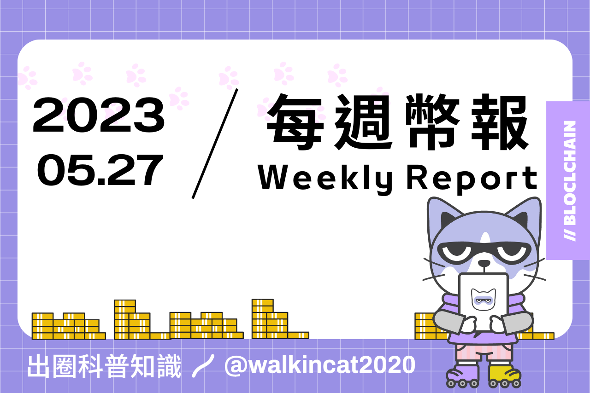

## 專案分析

- 淺析 Lybra Finance v2：創造 eUSD 應用場景、吸引 TVL 和 Tokenomics 優化
- 不要錯過 BTC 的新標準 SRC-20
- Blend —— Blur 的續命《易筋經》？

## 觀點剖析

- Vitalik：保持鏈的極簡主義，不要讓以太坊的共識過載
- 解讀 a16z 募資 Deck：遊戲賽道為何值得重注？
- 全鏈遊戲面面觀：空中樓閣還是沙漠綠洲？

## 市場分析

- 盤點 5 家頂級加密 VC 2023 年的投資趨勢
- 一文速覽以太坊大會 EDCON 2023 Super Demo 最終入圍專案
- 從 ERC20、721、1155 到 3525，詳述 RWA 邁向 Web3 大規模落地之路

## 熱門事件

- Multichain 事件後，教你如何識別穩定幣原生資産

---

## 淺析 Lybra Finance v2：創造 eUSD 應用場景、吸引 TVL 和 Tokenomics 優化
    
文中作者主要針對 Lybra Finance V2 提出相關的見解，Lybra finance 是一個超額抵押的穩定幣協議，透過將 ETH/stETH 作為抵押品存入並可鑄造出 eUSD，而持有的 eUSD 可以獲得相應的收益。

Lybra 即將在 6 月發佈 V2 測試網並於 7/8 月上線其主網，V2 的內容包括進行全鏈擴張、添加更多 LST 資產類型、新的 Tokenomics、協議收入/費用捕獲的改革，以及 DAO 的治理，作者根據這些內容作出他的預測及分析，並且認為這次的 V2 致力於解決原本在自身協議發展上及 eUSD 缺乏應用場景的問題，接下來協議的發展關鍵將會是在 eUSD 的充足流動性與流通場景上。Lybra Finance 是否能在升級為 V2 後繼續在 LSD 賽道發光發熱，就留待主網上線後市場給予真正的答案。

[https://panewslab.com/zh/articledetails/v1a0d50r.html](https://panewslab.com/zh/articledetails/v1a0d50r.html)
    

    
## 不要錯過 BTC 的新標準 SRC-20
    
本文討論了比特幣 (BTC) 上的新代幣標準 SRC-20 以及基於比特幣的 NFT Stamp NFT。SRC-20 是在 BRC-20 基礎上開發的，有點類似於 Ethereum (ETH) 的 ERC-1155。不同之處在於，BRC-20 的所有交易都儲存在見證數據中，而 SRC-20 的數據儲存在可花費的數據交易中，因此理論上在 BRC-20 上，你的代幣和數據可能會被從區塊鏈中刪除，而在 SRC-20 中，這是不可能的。
    
Stamp NFT 是 BTC 上的 NFT，其格式為 GIF 或大小不超過 6 KB 的圖像，並列在比特幣郵票上，無法刪除，雖然它的流行程度還沒有達到像 Ordinals 那樣，但它已開始取得進展。
    
接著文章給出了如何鑄造 SRC-20 代幣的步驟，這個過程可能看起來複雜，因為在這個早期階段還沒有創建足夠的工具，但作者相信這種情況將會很快的改變。最後作者也指出雖然早期進入的人獲得的利潤最大，不過也提醒大家要注意風險。
    
[https://followin.io/zh-Hans/feed/4711249](https://followin.io/zh-Hans/feed/4711249)
    

    
## ****Blend —— Blur 的續命《易筋經》？****
    
文章首先細數了過往幾個交易挖礦專案的結果來引入對於 Blur 是否在相同模式下有相應的策略來打破這個命運的思考。作者在文章中詳細分析了 Blur 推出的新功能 Blend，這是一種優化過的永續點對點借貸機制，其創新之處在於先買後付（BNPL）的機制，這有助於鼓勵用戶借款進行 NFT 交易。
    
然而，由於最近 NFT 市場的冷淡，Blend 推出後並未立即帶來交易量的大幅增長，因此作者認為其真正優勢可能在資產價格上升的時候才能體現，這時用戶可以借錢進行槓桿交易，以提高資金使用效率。最後，作者表示 Blend 可能會對 Blur 的未來產生重要影響，特別是在之後的空投激勵乏力情況下，可以作為平台交易量的額外支持，不過 Blend 能否真的成為 Blur 的 “續命易筋經”，還需要時間與市場來驗證。
    
[https://followin.io/zh-Hans/feed/4675424](https://followin.io/zh-Hans/feed/4675424)
    

## Vitalik：保持鏈的極簡主義，不要讓以太坊的共識過載
    
文章中 Vitalik 說明為什麼他認為許多利用以太坊驗證節點集合和以太坊社會共識的協議，其一部份的技術可能會給以太坊生態系統帶來高度的風險。他針對重用驗證者和社會共識過載的區分舉了許多例子來說明，並提到若設計的協議崩潰時，損失應只能被限制在選擇參與和使用協議的驗證者和用戶身上，如果必須透過生態系統的社會共識來解決，則是不被允許的，因為當驗證者必須做出更多額外的決策時，則可能因其中的決策而導致整個社區分裂。最後 Vitalik 提到區塊鏈的社會共識其實很脆弱，必須謹慎的使用，並在盡力保持鏈的極簡下安全的擴大以太方共識的角色。
    
[https://mp.weixin.qq.com/s/JdX0ZWOkx6x9ffYNmtO_0A](https://mp.weixin.qq.com/s/JdX0ZWOkx6x9ffYNmtO_0A)

    
## 解讀 a16z 募資 Deck：遊戲賽道為何值得重注？
    
加密風投巨頭 Andreessen Horowitz 從去年宣布推出首支遊戲基金 Games Fund One 到目前為止，已經進行了 25 項的投資，且規模達到了 6 億美元，基金管理人 Andrew Chen 披露了當時基金在 2022 年的募資 Deck。

Deck 中寫到會選擇遊戲產業進行投資，主要因為遊戲包含充滿活力的消費者生態、龐大的社交網路，而且通常遊戲是新平台的殺手級應用。
    
a16z 投資遊戲領域的優勢在於擁有資深遊戲行業經驗、專業化運營平台、跨遊戲的交流與結合、以及在遊戲投資上已有十年的經驗，能夠為創始人提供幫助。a16z 藉由額外提供被投專案在運營上的協助來做出差異化投資，從這部分也能看出為什麼 a16z 的風投事業會比其他團隊更加出色的原因。
    
[https://panewslab.com/zh/articledetails/0bdb46qi.html](https://panewslab.com/zh/articledetails/0bdb46qi.html)
    

    
## 全鏈遊戲面面觀：空中樓閣還是沙漠綠洲？
    
文章中透過深入分析全鏈遊戲的技術及當前難題，探討其在遊戲產業的未來潛力。目前的遊戲類型分為鏈下、半鏈及全鏈，三者在技術及目標對象皆有其明顯區別，全鏈遊戲因其核心邏輯及資產皆記錄在鏈上，相比其他兩者實現了更高的自主性與安全性，而要讓全鏈遊戲像傳統遊戲般順利運行，必須藉由其他工具來輔助，像是短暫鏈、應用特定預編譯、戰鬥 Rollup、全鏈遊戲引擎及同步機制等來達到完整的鏈上遊戲體驗。不過作者提到全鏈遊戲背後的理念並非所有人都能接受，主要的受眾可能會是追求共創遊戲世界及對遊戲有完全自主控制性的玩家。未來全鏈遊戲若能與帳戶抽象技術結合，在操作體驗上似乎就能彌平頻繁鏈上交互所帶來的阻礙，或許能讓更多人看見這片帶有賽博龐克風格的綠洲。
    
[https://www.techflowpost.com/article/detail_11972.html](https://www.techflowpost.com/article/detail_11972.html)

    
## 盤點 5 家頂級加密 VC 2023 年的投資趨勢
    
推文中整理了 2023 年前五大加密貨幣風險投資公司的幾個投資趨勢，圖表中可以明顯看出第一季度只有三月份是活躍的，作者認為這可能與市場的價格相關，而比特幣在 2023 年第一季度的價格以比上一季度稍微回升，因此作者預測在第二季度可能會有更多的投資活動。儘管第一季度風頭公司投入的資本呈現下降趨勢，不過整個投資活動對比上一次季度的數量是增加的。最後可以看到風投公司最長投資的產業類別分別是 DeFi、GameFi 和區塊鏈基礎設施，而這些類別正是準備進入大規模採用的階段。最後作者總結未來的風投活動可能會取決於比特幣的價格與市場熱度，並且會隨著未來監管的明確而逐漸增加。
    
[https://twitter.com/definapkin/status/1659211586052165636](https://twitter.com/definapkin/status/1659211586052165636)

## 一文速覽以太坊大會 EDCON 2023 Super Demo 最終入圍專案
    
以太坊大會 EDCON 公佈了 2023 年 Super Demo 的最終入圍專案，包括 EthStorage、Ethereum Attestation Service（EAS）、Aspis Protocol 和 Nerif Network。其中獲得第一名的 EthStorage 是以太坊上的的存儲 rollup，過去已獲得以太坊基金會兩次的官方贊助；EAS 是基於區塊鏈技術的認證服務，它把用戶的身份訊息儲存在以太鏈上，並由智能合約來進行管理和驗證；Aspis Protocol 是去中心化保險協議，透過智能合約來實現去中心化的保險申請及理賠；Nerif Network 是去中心化數據市場協議，可以提供用戶數據交易及共享的服務，也可以為 Dapp 提供數據支持。這些入圍的專案都是極具潛力的應用，未來勢必可以讓以太坊的生態更加茁壯。
    
[https://www.odaily.news/post/5187288](https://www.odaily.news/post/5187288)
    

## 從 ERC20、721、1155 到 3525，詳述 RWA 邁向 Web3 大規模落地之路
    
文中作者詳細解說了ERC-20、ERC-721 及 ERC-3525 的協議內容，並針對 ERC-3525 做更深入的探討。ERC-3525 除了是一種可拆分和組合特性的超級 NFT以及數字資產容器外，其可視化的特性被運用在複雜的金融衍生品時能夠在風險控制上起到一定的作用。對於在真實世界資產上鏈的部分，這個協議提供了極高的透明度和可組合性，並且可以完整的代表現實世界中各種金融資產和供應鏈中的資產。
    
在虛擬資產或商品上，ERC-3525 可用於代表虛擬土地、遊戲道具和會員卡等；在社交和身份領域，它能夠更好地表達社交圖譜和特定數據的屬性。雖然目前 ERC-3525 因其複雜性，對大眾的認知門檻上較高，並且市場的關注度也不高，不過相信在 RWA 的敘事慢慢開始時，這個具有潛力的協議能夠真正的被看見，並在未來的大規模採用上發揮它的關鍵價值與作用。
    
[https://panewslab.com/zh/articledetails/9ok2605q.html](https://panewslab.com/zh/articledetails/9ok2605q.html)
    

    
## Multichain 事件後，教你如何識別穩定幣原生資産
    
這兩天因為 Multichain 事件讓許多人了解到原來在 FTM 鏈上的 USDC 是橋接過後的並非官方的原生資產，因此作者藉由推文介紹了該如何確定哪些鏈上的 USDC 是由官方所發行的原生資產，以及若非原生的話要如何知道是由什麼跨鏈橋所支持。透過查詢官網可以得知 USDC 和 USDT 目前在哪些鏈上是原生資產，而其他鏈上的 USDC 橋接資產也可以透過 DeFillama 來查詢。最後作者建議用戶盡量持有主流鏈的原生資產，才能夠避免遇到 Multichain 事件。
    
[https://twitter.com/NintendoDoomed/status/1661568499129647106](https://twitter.com/NintendoDoomed/status/1661568499129647106)
    

## 結尾

感謝您閱讀本篇文章，希望本文的內容能夠對您有所啟發和幫助。

如果您對區塊鏈出圈科普知識感興趣，請搜索 🔍 WalkinCat 走路貓，了解更多相關資訊。如果您想繼續關注我們的最新文章，歡迎訂閱我們的電子報，或透過以下連結找到我們。我們期待您的想法和反饋，謝謝您的支持！

> [歡迎訂閱走路貓](https://portaly.cc/walkincat)